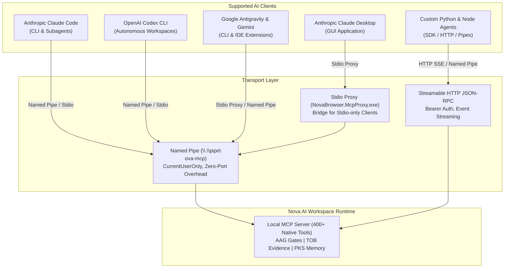

# Agent Integration Hub

Nova AI Workspace was built from the ground up to pair seamlessly with autonomous AI agents and developer tooling over the open **Model Context Protocol (MCP)**.

---

## Supported Agent Clients

Nova provides native, verified integrations for all major AI coding and automation platforms:

---

## Integration Guides

Choose the guide matching your agent client:

1. **[Claude Code CLI (`claude-code.md`)](claude-code.md)**
   Setup for Anthropic's autonomous terminal agent. Learn how to configure `.mcp.json`, run `nova.install_onboarding`, and structure agent instructions.

2. **[Claude Desktop (`claude-desktop.md`)](claude-desktop.md)**
   Configure Anthropic's official desktop application on Windows using `NovaBrowser.McpProxy.exe` as the stdio bridge.

3. **[OpenAI Codex & Google Antigravity (`codex-and-antigravity.md`)](codex-and-antigravity.md)**
   Configure OpenAI Codex CLI (`config.toml`) and Google Antigravity/Gemini agents for multi-agent workflows and parallel subagent execution.

4. **[Custom Python & Node.js Agents (`custom-agents.md`)](custom-agents.md)**
   Build custom agent loops using the official Python MCP SDK, Node.js MCP SDK, or direct Named Pipe / Streamable HTTP connections with rotating Bearer tokens.

---

## Transports & Security Principles

* **CurrentUserOnly Isolation:** All Named Pipes (`\\.\pipe\nova-mcp`) enforce Windows ACLs restricted exclusively to the current user token. No other user session on the machine can access Nova's automation pipe.
* **Rotating Bearer Tokens:** Nova generates an ephemeral 256-bit cryptographic bearer token upon every launch, written to the local project `.mcp.json`. Stale tokens are immediately rejected.
* **Zero Cloud Bleed:** All MCP communications remain strictly on the local machine (`127.0.0.1` loopback). No browser telemetry, DOM snapshots, or user session data are ever transmitted to external cloud servers.
