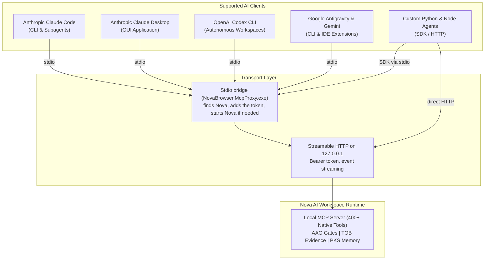

# Agent Integration Hub

Nova AI Workspace was built from the ground up to pair seamlessly with autonomous AI agents and developer tooling over the open **Model Context Protocol (MCP)**.

---

## Supported Agent Clients

Nova provides native, verified integrations for all major AI coding and automation platforms:

---

## Integration Guides

Choose the guide matching your agent client:

1. **[Claude Code CLI (`claude-code.md`)](claude-code.md)**
   Setup for Anthropic's autonomous terminal agent. Learn how Nova registers itself, how to add it by hand, run `nova.install_onboarding`, and structure agent instructions.

2. **[Claude Desktop (`claude-desktop.md`)](claude-desktop.md)**
   Configure Anthropic's official desktop application on Windows using `NovaBrowser.McpProxy.exe` as the stdio bridge.

3. **[OpenAI Codex & Google Antigravity (`codex-and-antigravity.md`)](codex-and-antigravity.md)**
   Configure OpenAI Codex CLI (`config.toml`) and Google Antigravity/Gemini agents for multi-agent workflows and parallel subagent execution.

4. **[Custom Python & Node.js Agents (`custom-agents.md`)](custom-agents.md)**
   Build custom agent loops using the official Python MCP SDK, Node.js MCP SDK, or a direct Streamable HTTP connection with Nova's access token.

---

## Transports & Security Principles

* **Local only by default:** Nova's MCP server listens on `127.0.0.1`. Other machines cannot connect unless you explicitly allow remote clients in Nova's settings.
* **Access token:** Every request needs Nova's access token. It is stored encrypted for your Windows account and stays the same across restarts, so registered AI programs keep working. The stdio bridge reads it by itself; it is never written into the config files of your AI programs.
* **What leaves your machine:** The MCP connection itself stays on your computer. What your AI program reads through Nova goes on to that program's provider, under its terms. What Nova itself transmits is listed in the [privacy notice](../../PRIVACY.md).
