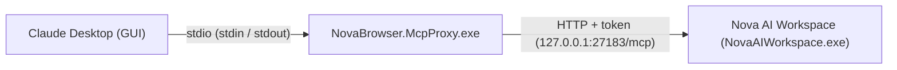

# Integrating Anthropic Claude Desktop

**Start here:** use Nova's connection wizard, click **Connect** if offered, and restart your AI program. Then follow the [first-task Quickstart](../getting-started/quickstart.md). The sections below cover manual configuration and advanced workflows.

This guide explains how to connect Anthropic's official **Claude Desktop** application on Windows with **Nova AI Workspace**.

---

## 1. Overview

Claude Desktop starts local MCP servers as programs and talks to them over standard input/output (`stdio`). Nova's bridge program, **`NovaBrowser.McpProxy.exe`**, is that program: it takes Claude Desktop's requests and forwards them to Nova's local MCP server over HTTP on `127.0.0.1`, adding Nova's access token itself.



The bridge reads the current address and token from Nova's runtime file each time it connects. Your Claude Desktop config therefore never contains a token, and the bridge starts Nova if it is not running yet.

---

## 2. Configuration Setup

### A. Automatic (recommended)
When Nova starts, it adds a `nova` entry to Claude Desktop's config file and keeps it up to date. Quit Claude Desktop completely (also from the system tray) and start it again so it loads the entry.

If the entry is missing, open the connection wizard in Nova's settings and choose Claude Desktop.

### B. Manual
1. Open the Claude configuration folder in File Explorer:
   ```
   %APPDATA%\Claude\
   ```
2. Open `claude_desktop_config.json` in a text editor (create the file if it does not exist).
3. Add the `nova` entry inside `mcpServers`, keeping any other servers that are already there:

```json
{
  "mcpServers": {
    "nova": {
      "command": "C:\\Users\\<you>\\AppData\\Local\\nova-cognitive\\Nova\\bin\\NovaBrowser.McpProxy.exe"
    }
  }
}
```

> [!IMPORTANT]
> **Windows paths in JSON:** every backslash must be written twice (`\\`), as above. Replace `<you>` with your Windows user name.

> [!NOTE]
> If the setup could not move the profile of an installation from before the product rename, it is still in `%LOCALAPPDATA%\NovaBrowser`; the bridge is then at `%LOCALAPPDATA%\NovaBrowser\bin\NovaBrowser.McpProxy.exe`. Use the folder that exists on your machine.

---

## 3. Starting the Session

1. **Start Claude Desktop** (or restart it after a config change). Nova does not need to be running; the bridge starts it.
2. **Verify the connection:** open the tools menu in Claude Desktop's message box. Nova and its tools should be listed there.

---

## 4. Troubleshooting

### Nova's tools do not appear, or Claude Desktop reports an error
1. **Check that Nova's server answers.** With Nova running, in PowerShell:
   ```powershell
   Invoke-RestMethod http://127.0.0.1:27183/health
   ```
   `status : ready` means the server is up. If you changed Nova's port in the settings, use that port instead of `27183`.
2. **Check the bridge itself:**
   ```powershell
   & "$env:LOCALAPPDATA\nova-cognitive\Nova\bin\NovaBrowser.McpProxy.exe" --self-test
   ```
   It should print `NovaBrowser.McpProxy self-test OK`. If PowerShell cannot find the file, the bridge has not been set up yet: start Nova once.
3. **Read the logs:**
   * Claude Desktop: `%APPDATA%\Claude\logs\` (`mcp.log`, `mcp-server-nova.log`)
   * Nova's bridge: `%LOCALAPPDATA%\nova-cognitive\Nova\Logs\novabrowser-mcp-stdio-proxy.log`

More help: [Agent & MCP connection issues](../troubleshooting/agent-connection-issues.md).

---

## Next Steps

* Set up CLI workflows with **[Claude Code](claude-code.md)**.
* Learn how to configure **[OpenAI Codex](openai-codex.md)** and **[Google Antigravity](google-antigravity.md)**.
