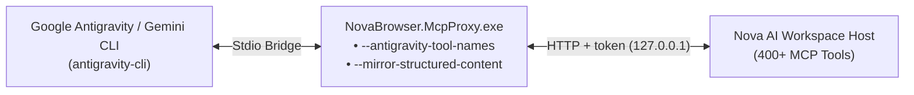

# Integrating Google Antigravity & Gemini CLI

> [!NOTE]
> This guide covers setting up **Google Antigravity (AGY)** and **Gemini CLI** to control **Nova AI Workspace**, detailing client-specific adapter flags (`--antigravity-tool-names`, `--mirror-structured-content`), lazy schema loading, and subagent swarm coordination.

---

## 1. Overview & Architecture

Google Antigravity is an agentic coding environment featuring multi-agent swarms, background subagents, and direct tool invocation. 

Because Antigravity and Gemini CLI enforce strict schema naming rules and handle tool response structures uniquely, Nova provides dedicated proxy flags to ensure seamless operation.



---

## 2. Antigravity-Specific Proxy Flags (Mandatory)

The Antigravity client has two architectural characteristics that require specific adapter switches in `NovaBrowser.McpProxy.exe`:

### Flag 1: `--antigravity-tool-names` (Underscore Transformation)
* **The Constraint:** Google Antigravity and Gemini CLI parser schemas strictly forbid dots in MCP tool identifiers (e.g. `nova.tabs` fails schema validation).
* **The Adapter:** Passing `--antigravity-tool-names` instructs `NovaBrowser.McpProxy` to transform all tool names from dots to underscores:
  * `nova.tabs` $\rightarrow$ `nova_tabs`
  * `nova.dom_extract` $\rightarrow$ `nova_dom_extract`
  * `nova.scroll_smart` $\rightarrow$ `nova_scroll_smart`
* The proxy transparently translates requests back to canonical dotted names before forwarding them to Nova's internal server.

### Flag 2: `--mirror-structured-content` (Structured Data Injection)
* **The Constraint:** In Antigravity CLI (issue `#953`), the client runtime passes only `content[].text` into the agent model's context window, dropping top-level `structuredContent` payloads.
* **The Symptom:** Without this flag, listing tools (like `nova_tabs`, `nova_domain_notes_list`, or `nova_eval`) return short summary strings (e.g., *"Tab inventory resolved. Use structuredContent.tabs for details"*), leaving the agent blind to the actual tab list or data.
* **The Adapter:** When `--mirror-structured-content` is active (which is also automatically implied by `--antigravity-tool-names`), the proxy intercepts tool responses, extracts the `structuredContent` JSON, formats it as Markdown, and injects it directly into `content[].text`.

---

## 3. Configuration Setup

### Option A: Automatic (recommended)
When Nova starts and finds Antigravity installed, it adds a `nova` entry to Antigravity's global MCP config, `%USERPROFILE%\.gemini\config\mcp_config.json`, with `--antigravity-tool-names` already set. Restart Antigravity once afterwards. If the entry is missing, open the connection wizard in Nova's settings and choose Antigravity.

### Option B: Manual
Add the entry to `%USERPROFILE%\.gemini\config\mcp_config.json`, keeping any other servers that are already there, with your Windows user name in place of `<you>`:

```json
{
  "mcpServers": {
    "nova": {
      "command": "C:\\Users\\<you>\\AppData\\Local\\nova-cognitive\\Nova\\bin\\NovaBrowser.McpProxy.exe",
      "args": ["--antigravity-tool-names"]
    }
  }
}
```

`--antigravity-tool-names` already includes `--mirror-structured-content`; you do not need to list both. Installations from before the product rename keep their profile in `%LOCALAPPDATA%\NovaBrowser`; the bridge is then at `%LOCALAPPDATA%\NovaBrowser\bin\NovaBrowser.McpProxy.exe`.

> [!WARNING]
> Add `--antigravity-tool-names` only to Antigravity's entry. Claude Code, Claude Desktop and Codex expect the normal dotted names (`nova.tabs`).

---

## 4. Advanced Proxy Tuning (Environment Variables)

You can fine-tune proxy behavior via environment variables:

| Variable | Default | Allowed Range | Description |
| :--- | :---: | :---: | :--- |
| **`NOVA_MCP_MIRROR_MAX_CHARS`** | `32,000` | 1,000 – 1,000,000 | Maximum character budget allocated for mirrored structured JSON blocks in `content.text`. |
| **`NOVA_MCP_AUTOSTART`** | `1` | `0` or `1` | Set to `0` to prevent the proxy from automatically launching Nova if the browser is closed. |
| **`NOVA_MCP_COLD_START_MS`** | `90,000` | 5,000 – 300,000 | Milliseconds the proxy waits for Nova to complete cold boot before timing out. |
| **`NOVA_MCP_CALL_GRACE_MS`** | `1,500` | 0 – 5,000 | Grace period added to tool call timeouts during heavy page loads. |

---

## 5. Lazy Schema Loading (`tools_bundle`)

Nova provides over 400 MCP tools. Loading all of their schema descriptions upfront into Antigravity would consume significant token context.

Antigravity leverages **Lazy Tool Loading**:
1. Antigravity discovers Nova tools as lazy-loaded tools.
2. The agent queries schemas on demand using `call_mcp_tool` or `nova_tools_bundle`:
   ```json
   nova_tools_bundle({ "toolName": "nova.dom_extract" })
   ```
3. This keeps the prompt context lean and focused on the active task.

---

## 6. Subagent Swarms & Multi-Agent Coordination

Antigravity frequently invokes concurrent subagents via `invoke_subagent`:

### Exclusive Leases (`nova_tab_claim`)
When multiple subagents explore or audit websites simultaneously:
```json
nova_tab_claim({
  "targetId": "tab-1",
  "purpose": "Autonomous price scraping",
  "leaseDurationMs": 180000
})
```
* Prevents other running subagents from closing, scrolling, or navigating `tab-1` while the lease is held.
* Call `nova_tab_release({ "targetId": "tab-1" })` upon completion.

### Cross-Subagent Knowledge Sharing (`nova_board_*`)
Subagents share findings across conversations without forwarding full chat transcripts:
```json
// Subagent A posts a verified finding:
nova_board_contribute({
  "topic": "aliexpress_anti_bot",
  "fact": "Search feed requires scroll_smart deltaY: 1200 to trigger virtualized list hydration",
  "confidence": 1.0
})

// Subagent B recalls shared findings:
nova_board_get({ "topic": "aliexpress_anti_bot" })
```
