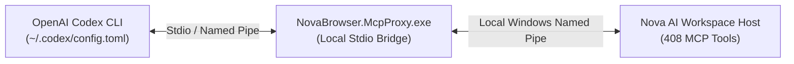

# Integrating OpenAI Codex CLI

> [!NOTE]
> This guide covers setting up **OpenAI Codex CLI** to control **Nova AI Workspace**, including configuration, task execution, and multi-agent coordination.

---

## 1. Overview & Architecture

OpenAI Codex CLI is an autonomous coding and shell agent capable of executing complex terminal commands, editing source files, and running browser automation tasks.

When connected to Nova AI Workspace over the Model Context Protocol (MCP), Codex gains direct programmatic control over live browser tabs, authenticated web sessions, and native ConPTY terminal instances.



---

## 2. Configuration (`~/.codex/config.toml`)

Codex CLI manages MCP server registrations via its central configuration file.

1. Open or create `%USERPROFILE%\.codex\config.toml`.
2. Add the `[mcp_servers.nova]` configuration block:

```toml
[mcp_servers.nova]
command = "C:\\Program Files\\Nova AI Workspace\\NovaBrowser.McpProxy.exe"
args = []
```

*(If running from a source checkout during development, point `command` to `dist\\NovaBrowser.McpProxy.exe`)*

### Supported Tool Naming
Codex natively supports standard MCP tool names containing dots (e.g. `nova.tabs`, `nova.navigate`, `nova.dom_extract`). No name transformation flags are required.

---

## 3. Running Autonomous Tasks with Codex

Once configured, launch Codex tasks requiring browser verification or DOM extraction:

```bash
codex "Audit the pricing table on https://example.com/pricing and verify subscription tiers using Nova."
```

Codex will automatically:
1. Launch or connect to Nova AI Workspace.
2. Call `nova.tab_new` or `nova.navigate` to open the target URL.
3. Extract DOM elements with `nova.dom_extract` or read layout geometries with `nova.measure_elements`.
4. Return structured facts verified against live browser state.

---

## 4. Multi-Agent & Subagent Swarms

When Codex delegates subtasks or spawns parallel worker sessions:

### Preventing Tab Collisions (`nova.tab_claim`)
To ensure two parallel Codex worker processes do not interfere with the same browser tab, workers must claim exclusive leases:

```json
nova.tab_claim({
  "targetId": "tab-1",
  "purpose": "Checkout flow audit",
  "leaseDurationMs": 180000
})
```

* If another agent attempts to interact with `tab-1` during the lease, Nova returns an **AAG Concurrency Lock (`-32002`)**.
* Upon completing the work, the agent releases the tab:
```json
nova.tab_release({ "targetId": "tab-1" })
```

### Shared Knowledge Board (`nova.board_contribute`)
Codex subagents can publish verified findings to the host memory board without polluting conversation context:
```json
nova.board_contribute({
  "topic": "pricing_matrix",
  "fact": "Enterprise tier requires annual commit: $499/mo",
  "confidence": 1.0
})
```
