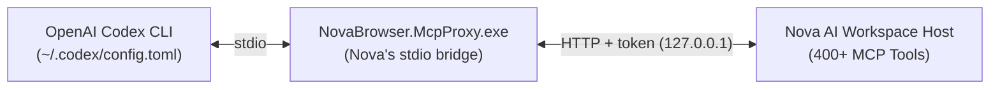

# Integrating OpenAI Codex CLI

> [!NOTE]
> This guide covers setting up **OpenAI Codex CLI** to control **Nova AI Workspace**, including configuration, task execution, and multi-agent coordination.

---

## 1. Overview & Architecture

OpenAI Codex CLI is an autonomous coding and shell agent capable of executing complex terminal commands, editing source files, and running browser automation tasks.

When connected to Nova AI Workspace over the Model Context Protocol (MCP), Codex gains direct programmatic control over live browser tabs, authenticated web sessions, and native ConPTY terminal instances.



The bridge reads Nova's current address and access token by itself, so the Codex config never contains a token, and it starts Nova if it is not running yet.

---

## 2. Configuration (`~/.codex/config.toml`)

### A. Automatic (recommended)
When Nova starts, it adds a `[mcp_servers.nova]` block to `%USERPROFILE%\.codex\config.toml` and keeps it up to date. Start a new Codex session afterwards so it loads the entry. If the block is missing, open the connection wizard in Nova's settings and choose Codex.

### B. Manual
1. Open or create `%USERPROFILE%\.codex\config.toml`.
2. Add the block, with your Windows user name in place of `<you>`:

```toml
[mcp_servers.nova]
enabled = true
command = "C:\\Users\\<you>\\AppData\\Local\\nova-cognitive\\Nova\\bin\\NovaBrowser.McpProxy.exe"
```

Installations from before the product rename keep their profile in `%LOCALAPPDATA%\NovaBrowser`; the bridge is then at `%LOCALAPPDATA%\NovaBrowser\bin\NovaBrowser.McpProxy.exe`.

### Supported Tool Naming
Codex natively supports standard MCP tool names containing dots (e.g. `nova.tabs`, `nova.navigate`, `nova.dom_extract`). No name transformation flags are required.

---

## 3. Running Autonomous Tasks with Codex

Once configured, launch Codex tasks requiring browser verification or DOM extraction:

```bash
codex "Audit the pricing table on https://example.com/pricing and verify subscription tiers using Nova."
```

Codex will automatically:
1. Launch or connect to Nova AI Workspace.
2. Call `nova.tab_new` or `nova.navigate` to open the target URL.
3. Extract DOM elements with `nova.dom_extract` or read layout geometries with `nova.measure_elements`.
4. Return structured facts verified against live browser state.

---

## 4. Multi-Agent & Subagent Swarms

When Codex delegates subtasks or spawns parallel worker sessions:

### Preventing Tab Collisions (`nova.tab_claim`)
To ensure two parallel Codex worker processes do not interfere with the same browser tab, workers must claim exclusive leases:

```json
nova.tab_claim({
  "targetId": "d2d64991",
  "agentId": "codex-worker-1",
  "ttlMs": 180000
})
```

* Tab IDs come from `nova.tabs`; the lease lasts `ttlMs` (default 120 s, 5 s to 30 min).
* If another agent calls a claimed tab, Nova refuses with error code `-32040` (`claim.owner_mismatch`) and names the owning `agentId`.
* Upon completing the work, the agent releases the tab with the same `agentId`:
```json
nova.tab_release({ "targetId": "d2d64991", "agentId": "codex-worker-1" })
```

### Shared Knowledge Board (`nova.board_contribute`)
The board is off by default (**Enable shared agent knowledge board** in the settings). It is not a
store for research results: agents record problems they hit with Nova's tools, as an `observation`,
a `refutation` (a path that did not help) or a `reproduction`, under a structured anchor. When a
later tool call fails with a matching symptom, Nova adds a `boardHint` pointing to the topic.
```json
nova.board_contribute({
  "kind": "observation",
  "openNew": true,
  "text": "scroll_smart does not load more rows in the search results list",
  "anchor": {
    "component": "mcp",
    "capability": "nova.scroll_smart",
    "operation": "scroll",
    "symptomClass": "no_effect",
    "host": "example.com"
  },
  "idempotencyKey": "search-scroll-no-effect-1"
})
```
