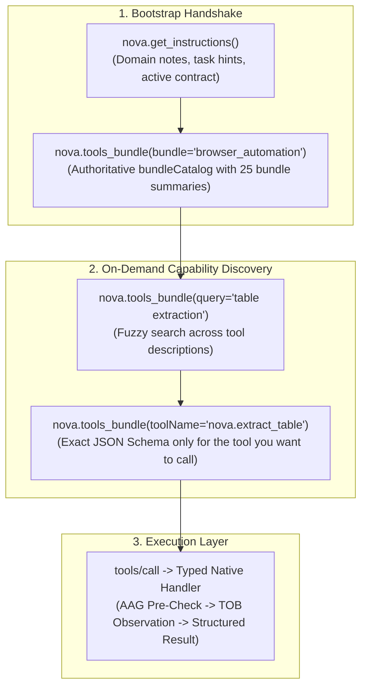

# Nova MCP Reference & Tool Index

Nova AI Workspace exposes over 400 native tools over the **Model Context Protocol (MCP)**, making it the most comprehensive browser automation and cognitive workspace platform in existence.

---

## 1. Architecture & Discovery Model

Loading 400+ full JSON Schemas into an LLM context window upfront consumes tens of thousands of tokens before the first action is taken. Nova solves this with a **Two-Tier Dynamic Discovery Model**:

1. **Bootstrap Call 1 (`nova.get_instructions`):** Ingests site-specific domain notes, operator preferences, and operational knowledge facts.
2. **Bootstrap Call 2 (`nova.tools_bundle`):** Returns the authoritative **`bundleCatalog`** — a concise inventory mapping all 25 capability bundles to one-line summaries.
3. **Lazy Schema Resolution:** When you need a specific tool, query its schema individually (`nova.tools_bundle(toolName="nova.xxx")`) instead of loading the entire catalog.

---

## 2. The 25 Capability Bundles (Master Index)

Every tool in Nova belongs to one or more functional bundles. You can request any bundle using `nova.tools_bundle(bundle="<id>")` or its aliases:

| # | Bundle ID | Summary & Core Purpose | Key Aliases | Primary Tools |
| :-: | :--- | :--- | :--- | :--- |
| **1** | **`browser_automation`** | Drive a live page: navigate, click, type, scroll, wait, upload, and batch actions. | `automation`, `autonomy` | `navigate`, `click_selector`, `type_selector`, `scroll_smart`, `wait_for_selector`, `run_sequence` |
| **2** | **`page_read_debug`** | Read a page and measure its layout: DOM, text, tables, console, network, overflow, clipped text, accessibility. | `debug`, `measure`, `layout`, `overflow` | `read_dom`, `dom_extract`, `read_text_structured`, `measure_elements`, `detect_overflow`, `audit_accessibility` |
| **3** | **`visual_evidence`** | Prove what a page looked like: screenshots, element crops, responsive sweeps, baseline pixel diffs. | `evidence`, `screenshots`, `visual qa` | `capture_screenshot`, `screenshot_diff`, `screenshot_baseline`, `responsive_screenshots`, `save_pdf` |
| **4** | **`pks_learning`** | Reuse and repair learned site UI playbooks instead of rediscovering selectors every run. | `pks`, `learning`, `phenomena` | `pks_get`, `pks_upsert`, `pks_match`, `pks_patch`, `telemetry_report`, `learn_promote`, `explain` |
| **5** | **`form_submission`** | Fill and submit a form, then verify the submission actually landed. | `form`, `forms`, `submit` | `guarded_send_message`, `guarded_submit_form`, `guarded_login`, `select_option`, `choose_option` |
| **6** | **`vault_auth`** | Log in with stored credentials without ever handling the plaintext password. | `vault`, `auth`, `credentials`, `login` | `vault_list`, `vault_get`, `vault_set`, `vault_prepare_fill`, `type_selector_secret`, `guarded_login` |
| **7** | **`task_memory`** | Carry recurring or multi-session work forward: match, progress, complete, verify or abort a task. | `tasks`, `task memory`, `knowledge board` | `goal_register`, `task_match`, `task_instance_create`, `task_instance_complete`, `board_contribute`, `coverage_scan` |
| **8** | **`crawler_ops`** | Cover many pages at once: crawl a site, verify a URL list, read a persistent URL index. | `crawler`, `crawl`, `site crawl` | `crawl_start`, `crawl_status`, `crawl_results`, `crawl_verify`, `site_urls`, `site_urls_report` |
| **9** | **`surface_explorer`** | Find UI states no URL reaches: menus, drawers, and hidden SPA panels. | `explorer`, `surface`, `ui explorer` | `explore_surface` |
| **10** | **`app_shell_recovery`** | Deal with Nova itself: connection setup, native dialogs, downloads panel, window, zoom, DevTools. | `app shell`, `recovery`, `native dialogs` | `ui_get_state`, `ui_inspect_native_dialog`, `ui_confirm_native_dialog`, `downloads_*`, `window_*` |
| **11** | **`system_tools`** | Cross-cutting helpers: sandboxes, memory notes, favorites, clipboard, approvals, cookie banners. | `system`, `convenience`, `clipboard` | `sandbox_*`, `memory_note`, `memory_recall`, `domain_note`, `permission_center_*`, `cmp_apply` |
| **12** | **`onboarding`** | Write Nova's MCP reference into a project and fetch bundled Nova subsystem docs. | `onboard`, `setup`, `agent onboarding` | `install_onboarding`, `get_onboarding`, `reference_docs_list`, `reference_doc_read` |
| **13** | **`device_emulation`** | See a page as another device: viewport, touch, user agent, dark mode, print, locale. | `emulation`, `mobile`, `responsive` | `emulation_use_device`, `emulation_set_media`, `emulation_set_locale`, `emulation_set_touch` |
| **14** | **`identity_management`** | Change which browser Nova claims to be: persistent identity presets and custom user agents. | `identity`, `user agent`, `ua` | `identity_get`, `identity_set`, `identity_presets` |
| **15** | **`fingerprint_protection`** | Control Canvas/Audio/WebGL/Hardware fingerprint spoofing per tab, per sandbox, or globally. | `fingerprint`, `canvas spoof` | `fingerprint_get`, `fingerprint_set_global`, `fingerprint_set_sandbox`, `fingerprint_set_tab` |
| **16** | **`scheduled_tasks`** | Run work later or repeatedly: cron, file watches, chain triggers, run history, task workspaces. | `scheduled`, `cron`, `task automation` | `scheduled_task_create`, `scheduled_task_runs`, `scheduled_task_workspace_*`, `scheduled_task_trigger` |
| **17** | **`secret_store`** | Give an agent an API key it can use but never read back: write-only encrypted env vars. | `secret`, `secrets`, `env secrets` | `secret_set`, `secret_list`, `secret_delete` |
| **18** | **`connector_ops`** | Use configured e-mail accounts (IMAP/SMTP) and server connections (SFTP/FTP): send, read, list, transfer. | `connector`, `mail`, `sftp`, `imap`, `smtp` | `connector_*`, `mail_folders`, `mail_list`, `mail_read`, `mail_send`, `sftp_*`, `ftp_*` |
| **19** | **`external_mcp`** | Run and call other MCP servers through Nova: add, start, stop, discover tools, invoke them. | `external`, `external mcp`, `mcp servers` | `external_servers`, `external_server_add`, `external_tools`, `external_tool_call` |
| **20** | **`proxy_management`** | Route traffic through a proxy: profiles, global/sandbox switching, health checks, credentials. | `proxy`, `proxies`, `proxy management` | `proxy_list`, `proxy_create`, `proxy_switch`, `proxy_test`, `proxy_status` |
| **21** | **`plugin_management`** | Write, test, and ship agent-authored browser plugins in Jint JS-VM. | `plugins`, `aap`, `browser extensions` | `plugin_create`, `plugin_test`, `plugin_request_permission`, `plugin_enable`, `plugin_inspect` |
| **22** | **`notifications`** | Send desktop notifications and manage the inbox plus per-site notification permissions. | `notifications`, `inbox` | `notifications_list`, `notifications_send`, `notifications_mark_read`, `notifications_permission_*` |
| **23** | **`site_data_management`** | Inspect or clear cookies, localStorage, sessionStorage, and cached browsing data. | `cookies`, `cache`, `storage`, `site data` | `cookie_list`, `cookie_set`, `cookie_delete`, `storage_inspect`, `storage_set`, `cache_clear` |
| **24** | **`session_recording`** | Record a session's network and DOM events, then query, export, or replay what happened. | `session recording`, `recording`, `har`, `trace` | `session_record_start`, `session_record_stop`, `session_record_query`, `session_record_export` |
| **25** | **`terminal_ops`** | Run shell commands in an agent-owned headless terminal, separate from the user's own. | `terminal`, `shell`, `command`, `tty` | `terminal_open`, `terminal_list`, `terminal_run_command`, `terminal_read`, `terminal_write` |

---

## 3. Global Parameter Conventions

Across all 400+ tools, Nova follows strict, consistent parameter conventions:

### A. Targeting (`targetId`)
* **`targetId`:** Specifies which browsing surface to interact with.
  * Omit or pass `null`: Defaults to the currently focused active tab.
  * String ID (e.g. `"tab-12"`): Interacts with a specific tab regardless of focus.
  * Sandbox Letter (e.g. `"A"`, `"B"`): Interacts directly with the root surface of that Sandbox.
  * `"main"`: References the primary browser host chrome.

### B. Output Detail (`outputDetail`)
* Supported by data-heavy tools (`nova.tabs`, `nova.crawl_results`, `nova.pks_list`):
  * `"minimal"` (Recommended for agents): Returns essential IDs, URLs, and status codes. Conserves context tokens.
  * `"full"`: Returns detailed metadata, headers, bounding boxes, and diagnostic attributes.

### C. Timeouts & Deadlines
* **`timeoutMs` / `waitMs`:** Execution deadline in milliseconds.
* Standard default: 5,000 ms to 30,000 ms.
* Hard ceiling: 60,000 ms. Actions exceeding the ceiling fail-fast with a timeout envelope rather than hanging indefinitely.

---

## 4. Deep-Dive Guides in This Reference

* **[Tool Catalog & Functional Breakdown (`tool-catalog.md`)](tool-catalog.md)**
  Comprehensive alphabetical and functional breakdown of all tools grouped by domain.
* **[Protocol, Framing & Typing Contract (`protocol-and-transport.md`)](protocol-and-transport.md)**
  Detailed specification of Named Pipe length-prefixed framing, Stdio Proxy communication, Streamable HTTP SSE, Bearer tokens, and error envelopes.
* **Dedicated Tool Domain Indexes (`tools/`):**
  * [Browser Navigation & Physical Automation](tools/browser-automation/README.md)
  * [DOM Perception & Semantic Extraction](tools/dom-and-reading/README.md)
  * [Layout Quality, Geometry & Web Vitals](tools/layout-and-qa/README.md)
  * [Visual Evidence, Screenshots & Archiving](tools/visual-evidence/README.md)
  * [Credentials, Vault & DPAPI Secret Keystore](tools/vault-and-security/README.md)
  * [Phenomenological Knowledge Store & Self-Learning](tools/pks-and-learning/README.md)
  * [Guarded Actions & Blocker Clearance](tools/guarded-actions/README.md)
  * [Headless Terminal Workspaces & TTY](tools/terminal-ops/README.md)
  * [Scheduled Tasks, Cron & Workspaces](tools/scheduled-tasks/README.md)
  * [Media Intelligence & Whisper Speech-to-Text](tools/media-and-transcription/README.md)
  * [Downloads Management & Queue Control](tools/downloads/README.md)
  * [Connectors, Mail & File Transfer](tools/connectors-and-mail/README.md)
  * [Session Tracing & DOM Event Recording](tools/session-recording/README.md)
  * [Proxy Routing & Network Interception](tools/proxy-and-network/README.md)
  * [Desktop Notifications & Alerts](tools/notifications/README.md)
  * [Device Emulation & Responsive Testing](tools/device-emulation/README.md)
  * [External MCP Servers & Tool Bridging](tools/external-mcp/README.md)
  * [Site Crawler & URL Discovery Index](tools/crawler-and-discovery/README.md)
  * [Episodic Task Memory & Guidance](tools/task-memory/README.md)
  * [App Shell, Dialogs & DevTools](tools/app-shell-and-ui/README.md)
  * [Site Data, Fingerprinting & Sandboxes](tools/site-data-and-identity/README.md)

---

## Next Steps

* Connect your agent via **[Agent Integration Hub](../integration/README.md)**.
* Read the architectural principles in **[Core Features](../core-features/README.md)**.
* Troubleshoot connection errors in **[Troubleshooting Hub](../troubleshooting/README.md)**.
