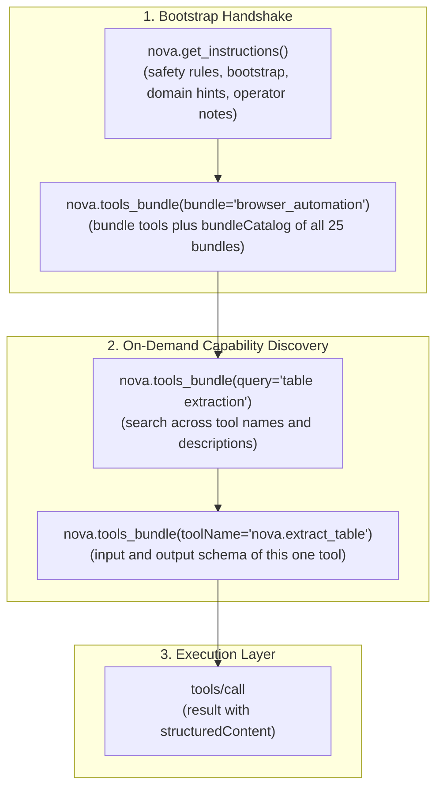
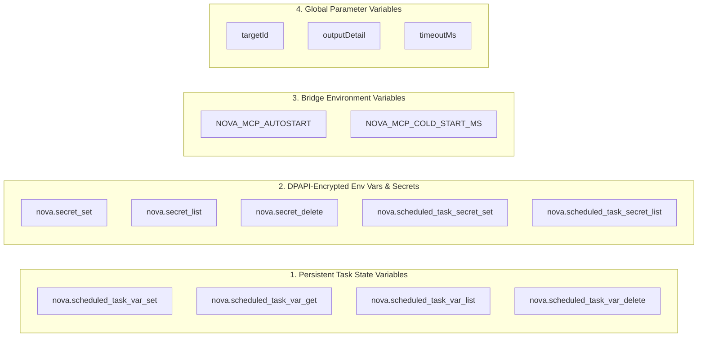

# Nova MCP Reference & Tool Index

Nova AI Workspace offers over 400 tools over the **Model Context Protocol (MCP)**. The exact number per area is listed in the [tool pages overview](tools/README.md), which is generated from the live tool catalog.

---

## 1. Architecture & Discovery Model

Loading the full JSON Schema of every tool into an agent's context up front costs a lot of tokens before the first action. Nova therefore lets an agent load tools in steps:

1. **Bootstrap Call 1 ([`nova.get_instructions`](tools/app-shell-and-ui/nova-get-instructions.md)):** Returns Nova's operating rules. The default `detail="compact"` answer carries the safety essentials, the session bootstrap, domain hints, operator notes and task hints; pass `taskKeywords` to get the notes that match the task. `detail="full"` returns the complete contract.
2. **Bootstrap Call 2 ([`nova.tools_bundle`](tools/app-shell-and-ui/nova-tools-bundle.md)):** Any bundle lookup also returns the **`bundleCatalog`** — every bundle id with a one-line summary. Pass `includeCatalog=false` once you have read it.
3. **One tool at a time:** When you need a specific tool, look up its schema with [`nova.tools_bundle`](tools/app-shell-and-ui/nova-tools-bundle.md)`(toolName="nova.xxx")` instead of loading a whole bundle with schemas. If you do not know the name, search with [`nova.tools_bundle`](tools/app-shell-and-ui/nova-tools-bundle.md)`(query="<task in plain words>")`.

---

## 2. The 25 Capability Bundles (Master Index)

Bundles group the tools for one kind of task; a tool can be part of several bundles. Request a bundle with [`nova.tools_bundle`](tools/app-shell-and-ui/nova-tools-bundle.md)`(bundle="<id>")` or one of its aliases. Click any tool name below to jump directly to its full parameter and response documentation:

| # | Bundle ID | Summary & Core Purpose | Key Aliases | Primary Tools |
| :-: | :--- | :--- | :--- | :--- |
| **1** | **`browser_automation`** | Drive a live page: navigate, click, type, scroll, wait, upload, and batch actions. | `automation`, `autonomy` | [`navigate`](tools/browser-automation/nova-navigate.md), [`click_selector`](tools/browser-automation/nova-click-selector.md), [`type_selector`](tools/browser-automation/nova-type-selector.md), [`scroll_smart`](tools/browser-automation/nova-scroll-smart.md), [`wait_for_selector`](tools/browser-automation/nova-wait-for-selector.md), [`run_sequence`](tools/browser-automation/nova-run-sequence.md) |
| **2** | **`page_read_debug`** | Read a page and measure its layout: DOM, text, tables, console, network, element widths, overflow, clipped text, accessibility. | `debug`, `measure`, `layout`, `overflow` | [`read_dom`](tools/dom-and-reading/nova-read-dom.md), [`dom_extract`](tools/dom-and-reading/nova-dom-extract.md), [`read_text_structured`](tools/dom-and-reading/nova-read-text-structured.md), [`measure_elements`](tools/layout-and-qa/nova-measure-elements.md), [`detect_overflow`](tools/layout-and-qa/nova-detect-overflow.md), [`audit_accessibility`](tools/layout-and-qa/nova-audit-accessibility.md) |
| **3** | **`visual_evidence`** | Prove what a page looked like: screenshots, element crops, responsive sweeps, baseline pixel diffs. | `evidence`, `screenshots`, `visual qa` | [`capture_screenshot`](tools/visual-evidence/nova-capture-screenshot.md), [`screenshot_diff`](tools/visual-evidence/nova-screenshot-diff.md), [`screenshot_baseline`](tools/visual-evidence/nova-screenshot-baseline.md), [`responsive_screenshots`](tools/visual-evidence/nova-responsive-screenshots.md), [`save_pdf`](tools/visual-evidence/nova-save-pdf.md) |
| **4** | **`pks_learning`** | Reuse and repair learned site UI playbooks instead of rediscovering selectors every run. | `pks`, `learning`, `phenomena` | [`pks_get`](tools/pks-and-learning/nova-pks-get.md), [`pks_upsert`](tools/pks-and-learning/nova-pks-upsert.md), [`pks_match`](tools/pks-and-learning/nova-pks-match.md), [`pks_patch`](tools/pks-and-learning/nova-pks-patch.md), [`telemetry_report`](tools/pks-and-learning/nova-telemetry-report.md), [`learn_promote`](tools/pks-and-learning/nova-learn-promote.md), [`explain`](tools/pks-and-learning/nova-explain.md) |
| **5** | **`form_submission`** | Fill and submit a form, then verify the submission actually landed. | `form`, `forms`, `submit` | [`guarded_send_message`](tools/guarded-actions/nova-guarded-send-message.md), [`guarded_submit_form`](tools/guarded-actions/nova-guarded-submit-form.md), [`guarded_login`](tools/guarded-actions/nova-guarded-login.md), [`select_option`](tools/browser-automation/nova-select-option.md), [`choose_option`](tools/browser-automation/nova-choose-option.md) |
| **6** | **`vault_auth`** | Log in with stored credentials without ever handling the plaintext password. | `vault`, `auth`, `credentials`, `login` | [`vault_list`](tools/vault-and-security/nova-vault-list.md), [`vault_get`](tools/vault-and-security/nova-vault-get.md), [`vault_set`](tools/vault-and-security/nova-vault-set.md), [`vault_prepare_fill`](tools/vault-and-security/nova-vault-prepare-fill.md), [`type_selector_secret`](tools/vault-and-security/nova-type-selector-secret.md), [`guarded_login`](tools/guarded-actions/nova-guarded-login.md) |
| **7** | **`task_memory`** | Carry recurring or multi-session work forward: match, progress, complete, verify or abort a task. | `tasks`, `task memory`, `knowledge board` | [`goal_register`](tools/task-memory/nova-goal-register.md), [`task_match`](tools/task-memory/nova-task-match.md), [`task_instance_create`](tools/task-memory/nova-task-instance-create.md), [`task_instance_complete`](tools/task-memory/nova-task-instance-complete.md), [`board_contribute`](tools/task-memory/nova-board-contribute.md), [`coverage_scan`](tools/task-memory/nova-coverage-scan.md) |
| **8** | **`crawler_ops`** | Cover many pages at once: crawl a site, verify a URL list, read a persistent URL index. | `crawler`, `crawl`, `site crawl` | [`crawl_start`](tools/crawler-and-discovery/nova-crawl-start.md), [`crawl_status`](tools/crawler-and-discovery/nova-crawl-status.md), [`crawl_results`](tools/crawler-and-discovery/nova-crawl-results.md), [`crawl_verify`](tools/crawler-and-discovery/nova-crawl-verify.md), [`site_urls`](tools/crawler-and-discovery/nova-site-urls.md), [`site_urls_report`](tools/crawler-and-discovery/nova-site-urls-report.md) |
| **9** | **`surface_explorer`** | Find UI states no URL reaches: menus, drawers, and hidden SPA panels. | `explorer`, `surface`, `ui explorer` | [`explore_surface`](tools/task-memory/nova-explore-surface.md) |
| **10** | **`app_shell_recovery`** | Deal with Nova itself: connection setup and status, native dialogs, downloads panel, window, zoom, DevTools, app screenshots. | `app shell`, `recovery`, `native dialogs` | [`ui_get_state`](tools/app-shell-and-ui/nova-ui-get-state.md), [`ui_inspect_native_dialog`](tools/app-shell-and-ui/nova-ui-inspect-native-dialog.md), [`ui_confirm_native_dialog`](tools/app-shell-and-ui/nova-ui-confirm-native-dialog.md), [`downloads_*`](tools/downloads/README.md), [`window_*`](tools/app-shell-and-ui/README.md) |
| **11** | **`system_tools`** | Nova's cross-cutting helpers: sandboxes, memory, notes, favorites, clipboard, approvals, permissions, cookie banners. | `system`, `convenience`, `clipboard` | [`sandbox_*`](tools/site-data-and-identity/README.md), [`memory_note`](tools/task-memory/nova-memory-note.md), [`memory_recall`](tools/task-memory/nova-memory-recall.md), [`domain_note`](tools/task-memory/nova-domain-note.md), [`permission_center_*`](tools/app-shell-and-ui/README.md), [`cmp_apply`](tools/guarded-actions/nova-cmp-apply.md) |
| **12** | **`onboarding`** | Write Nova's MCP reference into a project and fetch bundled Nova subsystem docs. | `onboard`, `setup`, `agent onboarding` | [`install_onboarding`](tools/app-shell-and-ui/nova-install-onboarding.md), [`get_onboarding`](tools/app-shell-and-ui/nova-get-onboarding.md), [`reference_docs_list`](tools/app-shell-and-ui/nova-reference-docs-list.md), [`reference_doc_read`](tools/app-shell-and-ui/nova-reference-doc-read.md) |
| **13** | **`device_emulation`** | See a page as another device: viewport, touch, user agent, dark mode, print, locale. | `emulation`, `mobile`, `responsive` | [`emulation_use_device`](tools/device-emulation/nova-emulation-use-device.md), [`emulation_set_media`](tools/device-emulation/nova-emulation-set-media.md), [`emulation_set_locale`](tools/device-emulation/nova-emulation-set-locale.md), [`emulation_set_touch`](tools/device-emulation/nova-emulation-set-touch.md) |
| **14** | **`identity_management`** | Change which browser Nova claims to be: persistent identity presets and custom user agents. | `identity`, `user agent`, `ua` | [`identity_get`](tools/site-data-and-identity/nova-identity-get.md), [`identity_set`](tools/site-data-and-identity/nova-identity-set.md), [`identity_presets`](tools/site-data-and-identity/nova-identity-presets.md) |
| **15** | **`fingerprint_protection`** | Control Canvas/Audio/WebGL/Hardware fingerprint spoofing per tab, per sandbox, or globally. | `fingerprint`, `canvas spoof` | [`fingerprint_get`](tools/site-data-and-identity/nova-fingerprint-get.md), [`fingerprint_set_global`](tools/site-data-and-identity/nova-fingerprint-set-global.md), [`fingerprint_set_sandbox`](tools/site-data-and-identity/nova-fingerprint-set-sandbox.md), [`fingerprint_set_tab`](tools/site-data-and-identity/nova-fingerprint-set-tab.md) |
| **16** | **`scheduled_tasks`** | Run work later or repeatedly: cron, file watches, chain triggers, run history, task workspaces, persistent state variables. | `scheduled`, `cron`, `task automation` | [`scheduled_task_create`](tools/scheduled-tasks/nova-scheduled-task-create.md), [`scheduled_task_runs`](tools/scheduled-tasks/nova-scheduled-task-runs.md), [`scheduled_task_trigger`](tools/scheduled-tasks/nova-scheduled-task-trigger.md), [`scheduled_task_var_set`](tools/scheduled-tasks/nova-scheduled-task-var-set.md), [`scheduled_task_var_get`](tools/scheduled-tasks/nova-scheduled-task-var-get.md), [`scheduled_task_var_list`](tools/scheduled-tasks/nova-scheduled-task-var-list.md), [`scheduled_task_var_delete`](tools/scheduled-tasks/nova-scheduled-task-var-delete.md), [`scheduled_task_workspace_*`](tools/scheduled-tasks/nova-scheduled-task-workspace.md) |
| **17** | **`secret_store`** | Give an agent an API key it can use but never read back: write-only DPAPI-encrypted env vars & task secrets. | `secret`, `secrets`, `env secrets` | [`secret_set`](tools/vault-and-security/nova-secret-set.md), [`secret_list`](tools/vault-and-security/nova-secret-list.md), [`secret_delete`](tools/vault-and-security/nova-secret-delete.md), [`scheduled_task_secret_set`](tools/scheduled-tasks/nova-scheduled-task-secret-set.md), [`scheduled_task_secret_list`](tools/scheduled-tasks/nova-scheduled-task-secret-list.md) |
| **18** | **`connector_ops`** | Use the user's configured e-mail accounts and SFTP/FTP servers: send, read, list, transfer. | `connector`, `mail accounts`, `sftp`, `imap`, `smtp` | [`connector_*`](tools/connectors-and-mail/README.md), [`mail_folders`](tools/connectors-and-mail/nova-mail-folders.md), [`mail_list`](tools/connectors-and-mail/nova-mail-list.md), [`mail_read`](tools/connectors-and-mail/nova-mail-read.md), [`mail_send`](tools/connectors-and-mail/nova-mail-send.md), [`sftp_*`](tools/connectors-and-mail/nova-sftp-list.md), [`ftp_*`](tools/connectors-and-mail/nova-ftp-list.md) |
| **19** | **`external_mcp`** | Run and call other MCP servers through Nova: add, start, stop, discover tools, invoke them. | `external`, `external mcp`, `mcp servers` | [`external_servers`](tools/external-mcp/nova-external-servers.md), [`external_server_add`](tools/external-mcp/nova-external-server-add.md), [`external_tools`](tools/external-mcp/nova-external-tools.md), [`external_tool_call`](tools/external-mcp/nova-external-tool-call.md) |
| **20** | **`proxy_management`** | Route traffic through a proxy: profiles, global/sandbox switching, health checks, credentials. | `proxy`, `proxies`, `proxy management` | [`proxy_list`](tools/proxy-and-network/nova-proxy-list.md), [`proxy_create`](tools/proxy-and-network/nova-proxy-create.md), [`proxy_switch`](tools/proxy-and-network/nova-proxy-switch.md), [`proxy_test`](tools/proxy-and-network/nova-proxy-test.md), [`proxy_status`](tools/proxy-and-network/nova-proxy-status.md) |
| **21** | **`plugin_management`** | Write, test, and ship agent-authored browser plugins that change how pages behave. | `plugins`, `aap`, `browser extensions` | [`plugin_create`](tools/plugins/nova-plugin-create.md), [`plugin_test`](tools/plugins/nova-plugin-test.md), [`plugin_request_permission`](tools/plugins/nova-plugin-request-permission.md), [`plugin_enable`](tools/plugins/nova-plugin-enable.md), [`plugin_inspect`](tools/plugins/nova-plugin-inspect.md) |
| **22** | **`notifications`** | Send desktop notifications and manage the inbox plus per-site notification permissions. | `notifications`, `inbox` | [`notifications_list`](tools/notifications/nova-notifications-list.md), [`notifications_send`](tools/notifications/nova-notifications-send.md), [`notifications_mark_read`](tools/notifications/nova-notifications-mark-read.md), [`notifications_permission_*`](tools/notifications/nova-notifications-permissions-list.md) |
| **23** | **`site_data_management`** | Inspect or clear cookies, localStorage, sessionStorage, and cached browsing data. | `cookies`, `cache`, `storage`, `site data` | [`cookie_list`](tools/site-data-and-identity/nova-cookie-list.md), [`cookie_set`](tools/site-data-and-identity/nova-cookie-set.md), [`cookie_delete`](tools/site-data-and-identity/nova-cookie-delete.md), [`storage_inspect`](tools/site-data-and-identity/nova-storage-inspect.md), [`storage_set`](tools/site-data-and-identity/nova-storage-set.md), [`cache_clear`](tools/site-data-and-identity/nova-cache-clear.md) |
| **24** | **`session_recording`** | Record a session's network and DOM events, then query, export, or replay what happened. | `session recording`, `recording`, `har`, `trace` | [`session_record_start`](tools/session-recording/nova-session-record-start.md), [`session_record_stop`](tools/session-recording/nova-session-record-stop.md), [`session_record_query`](tools/session-recording/nova-session-record-query.md), [`session_record_export`](tools/session-recording/nova-session-record-export.md) |
| **25** | **`terminal_ops`** | Run shell commands in an agent-owned headless terminal, separate from the user's own. | `terminal`, `shell`, `command`, `tty` | [`terminal_open`](tools/terminal-ops/nova-terminal-open.md), [`terminal_list`](tools/terminal-ops/nova-terminal-list.md), [`terminal_run_command`](tools/terminal-ops/nova-terminal-run-command.md), [`terminal_read`](tools/terminal-ops/nova-terminal-read.md), [`terminal_write`](tools/terminal-ops/nova-terminal-write.md) |

---

## 3. Variables, Secrets & State Injection

Nova distinguishes four tiers of runtime variables and cryptographic secrets across autonomous operations:

### A. Task State Variables (`nova.scheduled_task_var_*`)
Lightweight key-value state retained across scheduled task executions and browser restarts. Tasks track watermarks, timestamps, pagination cursors, and counters (up to 64 KB per value; supports JSON strings) without creating intermediate files on disk:
* **[`nova.scheduled_task_var_set`](tools/scheduled-tasks/nova-scheduled-task-var-set.md):** Stores or updates a persistent variable for a task.
* **[`nova.scheduled_task_var_get`](tools/scheduled-tasks/nova-scheduled-task-var-get.md):** Reads the current value of a task variable.
* **[`nova.scheduled_task_var_list`](tools/scheduled-tasks/nova-scheduled-task-var-list.md):** Lists variable keys and value previews configured for a task.
* **[`nova.scheduled_task_var_delete`](tools/scheduled-tasks/nova-scheduled-task-var-delete.md):** Removes a state variable when no longer needed.
* *Architecture guide:* [Scheduled Tasks & Cron Engine](../core-features/scheduled-tasks/README.md).

### B. Encrypted Environment Variables & Secrets (`nova.secret_*`)
Write-only cryptographic storage for API keys and auth tokens (`OPENAI_API_KEY`, `GITHUB_TOKEN`, etc.) protected at rest via Windows Data Protection API (DPAPI). Plaintext values are never returned by any tool; instead, Nova injects them directly as process environment variables into authorized terminal sessions and background task runners:
* **[`nova.secret_set`](tools/vault-and-security/nova-secret-set.md):** Stores an encrypted secret with strict injection scopes (`workspace`, `task`, `global`). Rejects reserved system names (`PATH`, `TEMP`, `NOVA_*`).
* **[`nova.secret_list`](tools/vault-and-security/nova-secret-list.md):** Lists registered secret names, scopes, and target IDs without exposing plaintext values.
* **[`nova.secret_delete`](tools/vault-and-security/nova-secret-delete.md):** Permanently revokes and purges an encrypted secret.
* **[`nova.scheduled_task_secret_set`](tools/scheduled-tasks/nova-scheduled-task-secret-set.md):** Stores a DPAPI-encrypted secret scoped specifically to a scheduled task.
* **[`nova.scheduled_task_secret_list`](tools/scheduled-tasks/nova-scheduled-task-secret-list.md):** Lists registered secret keys bound to a task without disclosing values.
* *Architecture guide:* [Password Vault & DPAPI Keystore](../core-features/privacy/vault-and-secrets/README.md).

### C. Bridge Environment Variables
OS environment variables controlling the lifecycle and timing of Nova's native stdio bridge (`NovaBrowser.McpProxy.exe`):
* **`NOVA_MCP_AUTOSTART`:** Set to `0` to disable automatic launch of Nova when client connects.
* **`NOVA_MCP_COLD_START_MS`:** Configures bridge cold-start timeout in milliseconds (default `90000`, range `5000`–`300000`).
* *Specification:* [MCP Protocol & Transport Contract](protocol-and-transport.md#a-stdio-bridge-novabrowsermcpproxyexe).

### D. Secondary Server Environment Variables
* **[`nova.external_server_update`](tools/external-mcp/nova-external-server-update.md):** Updates environment variables, endpoints, and transport arguments for secondary external MCP server processes.

---

## 4. Global Parameter Conventions

These conventions recur across many tools. The parameter table on each [tool page](tools/README.md) is generated from the live catalog and is the binding reference for defaults and limits.

### A. Targeting (`targetId`)
* **`targetId`:** Specifies which surface a tool acts on. Inspect open tabs and sandboxes via [`nova.tabs`](tools/browser-automation/nova-tabs.md).
  * Sandboxes have letter IDs (e.g. `"A"`, `"B"`); browser tabs have generated IDs. Do not hard-code tab IDs — they change as tabs open and close.
  * Most tab tools fall back to `"active"` (the currently active target) when `targetId` is left out; `"activeBrowserTab"` picks the active browser tab. Some tools require an explicit `targetId` — see [Browser Navigation & Physical Automation](tools/browser-automation/README.md).

### B. Output Detail (`outputDetail`)
* Many tools accept `outputDetail` to shrink the answer: [`nova.tabs`](tools/browser-automation/nova-tabs.md) takes `minimal`, `summary` or `full`; action tools such as [`nova.click_selector`](tools/browser-automation/nova-click-selector.md) take `compact`, `full` or `minimal`. The tool page lists the values and default.
* No setting hides a safety warning.

### C. Timeouts & Deadlines (`timeoutMs`)
* **`timeoutMs`** sets how long a tool waits, in milliseconds. Defaults and limits are per tool — [`nova.wait_for_selector`](tools/browser-automation/nova-wait-for-selector.md), for example, waits 10,000 ms by default and accepts up to 300,000 ms.
* Inside [`nova.run_sequence`](tools/browser-automation/nova-run-sequence.md), a raised tool timeout also needs a larger step budget.

---

## 5. Deep-Dive Guides in This Reference

* **[Tool Catalog (`tool-catalog.md`)](tool-catalog.md)**
  Every tool with its parameters, grouped by area, each linked to its own page.
* **[Protocol, Framing & Typing Contract (`protocol-and-transport.md`)](protocol-and-transport.md)**
  How the stdio bridge and the Streamable HTTP endpoint work: framing, switches, access token, session header, health probe and error envelopes.
* **Dedicated Tool Domain Indexes (`tools/`):**
  * [Browser Navigation & Physical Automation](tools/browser-automation/README.md)
  * [DOM Perception & Semantic Extraction](tools/dom-and-reading/README.md)
  * [Layout Quality, Geometry & Web Vitals](tools/layout-and-qa/README.md)
  * [Visual Evidence, Screenshots & Archiving](tools/visual-evidence/README.md)
  * [Credentials, Vault & DPAPI Secret Keystore](tools/vault-and-security/README.md)
  * [Phenomenological Knowledge Store & Self-Learning](tools/pks-and-learning/README.md)
  * [Guarded Actions & Blocker Clearance](tools/guarded-actions/README.md)
  * [Headless Terminal Workspaces & TTY](tools/terminal-ops/README.md)
  * [Scheduled Tasks, Cron & Workspaces](tools/scheduled-tasks/README.md)
  * [Media Intelligence & Whisper Speech-to-Text](tools/media-and-transcription/README.md)
  * [Downloads Management & Queue Control](tools/downloads/README.md)
  * [Connectors, Mail & File Transfer](tools/connectors-and-mail/README.md)
  * [Session Tracing & DOM Event Recording](tools/session-recording/README.md)
  * [Proxy Routing & Network Interception](tools/proxy-and-network/README.md)
  * [Desktop Notifications & Alerts](tools/notifications/README.md)
  * [Device Emulation & Responsive Testing](tools/device-emulation/README.md)
  * [External MCP Servers & Tool Bridging](tools/external-mcp/README.md)
  * [Site Crawler & URL Discovery Index](tools/crawler-and-discovery/README.md)
  * [Episodic Task Memory & Guidance](tools/task-memory/README.md)
  * [App Shell, Dialogs & DevTools](tools/app-shell-and-ui/README.md)
  * [Site Data, Fingerprinting & Sandboxes](tools/site-data-and-identity/README.md)
  * [Agent-Authored Plugins](tools/plugins/README.md)

---

## Next Steps

* Connect your agent via **[Agent Integration Hub](../integration/README.md)**.
* Read the architectural principles in **[Core Features](../core-features/README.md)**.
* Troubleshoot connection errors in **[Troubleshooting Hub](../troubleshooting/README.md)**.
