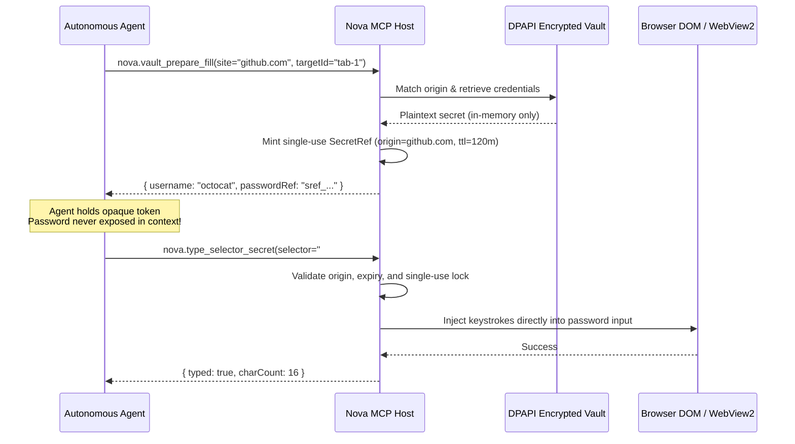

# `nova.vault_prepare_fill`

Prepares stored credentials from the secure Vault for automated form-filling, returning an ephemeral, origin-bound, and single-use `SecretRef` token instead of the raw password string.

---

## 1. Overview

LLM-driven browser automation poses a severe credential security risk: if an agent reads a plaintext password to fill a web login form, that secret is exposed in LLM context logs, API provider telemetry, and prompt histories.

`nova.vault_prepare_fill` solves this by issuing an ephemeral **`SecretRef`** handle. The agent receives only an opaque token (e.g. `sref_98a7f1...`), which is cryptographically bound to the target tab's origin and expires automatically. The agent then passes this token to [`nova.type_selector_secret`](nova-type-selector-secret.md) to type the password directly into the browser without ever knowing the underlying plaintext.

* **Capability Bundle:** `vault_and_security`, `form_submission`
* **Zero Plaintext Exposure:** Passwords never touch the LLM conversation context or prompt logs.
* **Origin Binding:** Tokens are strictly bound to the target tab's active origin (e.g. `https://github.com`); redemption on any other domain is rejected.
* **Single-Use & Time-Bounded:** Tokens expire after 120 minutes and can only be redeemed once.

---

## 2. Security Architecture



---

## 3. Parameter Reference

<!-- generated:parameters (from the live tool catalog; do not edit by hand, regenerate with NOVA_UPDATE_PUBLIC_TOOL_DOCS=1) -->
| Parameter | Type | Required | Default | Allowed | Description |
| :--- | :--- | :---: | :--- | :--- | :--- |
| `targetId` | `string` | No | — | — | Tab ID or 'active'. The SecretRef will be bound to this tab's origin. |
| `site` | `string` | Yes | — | — | Site to match in the vault (e.g. 'github.com'). |
| `username` | `string` | No | — | — | Optional: specific username to match. |

**`_meta.intent` is required.** Pass a short reason for the call, e.g. `"_meta": { "intent": "why this call is needed" }`; calls without it are rejected.
<!-- /generated:parameters -->

---

## 4. Example Calls

### Request Fill Token for Single-Account Site
```json
{
  "_meta": { "intent": "Logging into GitHub to create staging repository" },
  "site": "github.com",
  "targetId": "tab-101"
}
```

### Request Fill Token for Specific User Account
```json
{
  "_meta": { "intent": "Admin login for system maintenance" },
  "site": "aws.amazon.com",
  "username": "infra-admin@example.com",
  "targetId": "tab-102"
}
```

---

## 5. Return Value Structure

```json
{
  "site": "github.com",
  "username": "octocat",
  "passwordRef": "sref_a819b02fe4918237c1894d",
  "targetOrigin": "https://github.com",
  "expiresInSeconds": 7200,
  "singleUse": true
}
```

---

## 6. Common Errors & Troubleshooting

| Error Code / Message | Cause | Corrective Action |
| :--- | :--- | :--- |
| `Vault entry not found: ...` | No saved credentials match the specified domain. | Verify domain name or check stored entries with [`nova.vault_list`](nova-vault-list.md). |
| `Multiple accounts found` | Multiple credentials exist for the domain and no `username` was specified. | Inspect returned usernames and supply `username` in the call. |
| `Origin mismatch` | Target tab navigated to another domain before token redemption. | Re-issue a new token on the target origin. |

---

## 7. Related Tools & Documentation

* [`nova.type_selector_secret`](nova-type-selector-secret.md) ? Redeem the `SecretRef` to type the password.
* [`nova.vault_list`](nova-vault-list.md) ? List available credential sites and usernames.
* [`nova.vault_get`](nova-vault-get.md) ? Inspect site credential metadata without passwords.
* [Vault & Secret Management](../../../core-features/vault-and-secrets.md) ? Architectural overview of DPAPI-encrypted credential management.
