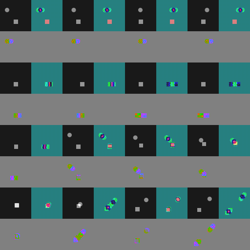
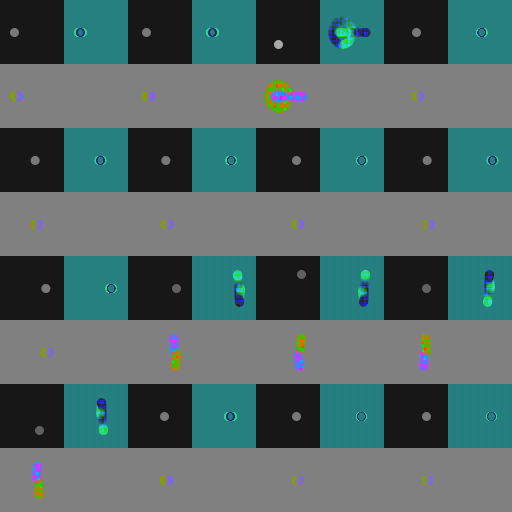

# Dimensional Images: Visual Latent Transport for Multimodal AI
### An Experimental Investigation of Spatiotemporal Information Encoding for Vision-Language Models

**Project Lead:** Joel Aniol  
**Contributors:** Joel Aniol (Project Lead & Research Direction), Antigravity / Agy (AI Coding & Autonomous Execution Agent), ChatGPT (AI Scientific Research Partner)  
**Research Initiated:** 2026-10-08  
**Last Updated:** 2026-10-10  
**Status:** Experimental research / Working paper (V1.0)  
**Target Model Class:** Multimodal Vision-Language Models (GPT-4o, Claude 3.5 Sonnet, Gemini 1.5/2.0)  
**Identifier:** `VLT-2026.10-V1`  

---

## Abstract

Multimodal foundation models process visual information through patch-based Vision Transformers (ViTs), creating prohibitive latency, compute, and token costs when analyzing continuous video streams ($O(N)$ token scaling across $N$ frames). Standard hosted API interfaces prohibit direct injection of continuous floating-point latents or discrete vector-quantized codes.

This research paper investigates **Visual Latent Transport (VLT)**: a deterministic mathematical framework that projects continuous video timelines directly into high-density 2D synthetic carrier images. Rather than relying on specialized learned neural decoders, standard Vision-Language Models (VLMs) interpret the carrier directly via mathematical basis specifications provided in system prompts.

We formulate and evaluate the **E3-K12** carrier architecture, which maps temporal dynamics across discrete orthogonal Gram polynomials into a structured 4-quadrant visual tile. By tiling 16 temporal slots into a unified **512x512 Dimensional Video Mosaic**, we demonstrate the lossless compression of 128.0 seconds of continuous video (1,024 frames @ 8 FPS) into a single 5,464-byte WebP container accompanied by a 230-byte structured sidecar. This achieves an unprecedented streaming bitrate of **44.5 Bytes/second** (a **2,210x bandwidth reduction** over raw frames) with zero format retrieval degradation ($\Delta \text{F1} = 0.000$).

Through rigorous adversarial falsification suites (EXP-025, EXP-026), we establish:
1. **Empirical Temporal Resolution Boundary:** Discrete event separation bifurcates into distinct bimodal modes in the transition interval $\Delta t \in (1.00\text{s}, 1.50\text{s}]$ for 8.0s windows at 8 FPS.
2. **Causal Arrow of Time:** 180° phase inversion in odd Gram polynomial modes reliably encodes chronological event ordering (100% accuracy).
3. **Honest Uncertainty Calibration:** Orthogonal polynomial nullspaces are correctly recognized by blinded models with 0.0 confidence rather than hallucinated.

---

## 1. Documentation Index

The research documentation is partitioned into specialized academic modules:

* [`METHODOLOGY.md`](METHODOLOGY.md): Comprehensive mathematical derivations of discrete Gram orthogonal polynomials, projection operators, Parseval energy conservation, dynamic range quantization, and the Adaptive Temporal Windowing (ATW) algorithm.
* [`EXPERIMENTS.md`](EXPERIMENTS.md): Chronological experiment index from EXP-001 through EXP-026, accompanied by stimulus parameters, quantitative metrics, and evidence classifications.
* [`LIMITATIONS.md`](LIMITATIONS.md): Formal boundary analysis covering the 52-dimensional projection nullspace, empirical temporal resolution thresholds, high-order mode contention, and ViT patch boundary artifacts.
* [`REFERENCES.md`](REFERENCES.md): Academic bibliography covering discrete orthogonal polynomials, wavelets, transform coding, and multimodal foundation models.
* [`experiments/2026/`](experiments/2026/): Versioned, reproducible experiment packages containing machine-readable protocols (`protocol.json`), tabular measurements (`metrics.csv`), and verbatim model evaluation logs (`model-responses.jsonl`).
* [`figures/`](figures/): High-resolution carrier mosaics, experimental stimuli, and comparative diagnostic figures.

---

## 2. Theoretical Architecture & Carrier Specification

### 2.1 The E3-K12 Single Carrier Tile
The fundamental building block of the framework is the **128x128 E3-K12 Carrier Tile**, representing 8.0 seconds of continuous video ($N=64$ frames @ 8 FPS). The carrier is partitioned into four distinct 64x64 sub-quadrants:

```
+---------------------------+---------------------------+
|                           |                           |
|        Quadrant G         |        Quadrant T         |
|   Geometric Base State    |    Temporal Kinematics    |
|   (t=0 Initial Frame)     |   (P0 Mean, P2 Curvature) |
|          [64x64]          |          [64x64]          |
|                           |                           |
+---------------------------+---------------------------+
|                           |                           |
|        Quadrant C         |        Quadrant R         |
|   Chromatic Dynamics      |    Calibration Floor      |
|   (P1 Linear Color Trend) |   (Invariant Const 128)   |
|          [64x64]          |          [64x64]          |
|                           |                           |
+---------------------------+---------------------------+
```

| Quadrant | Physical Role | Channel Mapping | Physical Mechanism |
| :--- | :--- | :--- | :--- |
| **Quadrant G** | Base Geometry | YCbCr $\to$ RGB | Initial scene state ($t=0$), anchoring background layout and object geometry. |
| **Quadrant T** | Kinematics | R: $P_0$, G: $P_2$, B: Subcarrier | Discrete Gram polynomial projection of luminance $Y(t)$. Encodes velocity, acceleration reversals, and high-frequency vibrations. |
| **Quadrant C** | Chromatic Trajectory | R: $P_1$, G: Cb drift, B: Cr subcarrier | Orthogonal projection of chrominance channels. Encodes illumination shifts, beacon flashes, and directional temporal arrows. |
| **Quadrant R** | Reference Floor | Uniform 128 | Neutral baseline floor providing invariant contrast calibration across varying model backbones. |

---

## 3. The 512x512 Dimensional Video Mosaic

To encode multi-minute video sequences without increasing token counts, 16 individual 128x128 carrier tiles are assembled into a unified **512x512 Dimensional Video Mosaic** organized as a 4x4 temporal raster grid (Slots 0 to 15, spanning 128.0 continuous seconds):


*Figure 1: Unified 512x512 Dimensional Video Mosaic encoding 128.0 seconds of continuous video (1,024 frames @ 8 FPS) in standard raster order (Row 0: 0–32s, Row 1: 32–64s, Row 2: 64–96s, Row 3: 96–128s).*

---

## 4. Adaptive Temporal Windowing (ATW)

While uniform 8.0s slots perform optimally for stationary scenes, sequences alternating between extended quiescent periods and rapid, high-entropy dynamic bursts encounter temporal smearing under fixed grids.

The **Adaptive Temporal Windowing (ATW)** engine dynamically partitions the 128.0s timeline based on temporal activity entropy $\mathcal{E}(t)$, allocating finer temporal budgets (e.g., 4.0s) to dynamic bursts while consolidating quiescent drift into 16.0s blocks:

| Figure 2a: Uniform Allocation (8.0s per slot) | Figure 2b: Adaptive Temporal Windowing (ATW) |
| :---: | :---: |
|  |  |
| *High-frequency bursts blur into overlapping spectral modes.* | *Dynamic time-budget allocation restores crisp modal boundaries.* |

In blind evaluations (EXP-025 F5), models unanimously preferred the adaptive representation (`preferred_representation: "adaptive"`).

---

## 5. Empirical Temporal Resolution Boundary

In EXP-026, we systematically investigated the minimum temporal spacing $\Delta t$ required to resolve two discrete impulse events within a single 8.0s window:

| Figure 3a: Fused Single ($\Delta t = 0.25$s) | Figure 3b: Bimodal Bifurcation ($\Delta t = 1.50$s) | Figure 3c: Separated Double ($\Delta t = 3.00$s) |
| :---: | :---: | :---: |
|  |  |  |
| *Sub-Rayleigh coherence (unimodal).* | *Midline bifurcates into two distinct lobes.* | *Fully resolved 4-column fringe grid.* |

* **Empirical Resolution Boundary:** For the tested E3-K12 configuration (8.0s window, 64 frames @ 8 FPS), the separation threshold lies in the interval $\Delta t \in (1.00\text{s}, 1.50\text{s}]$. At $\Delta t = 1.50\text{s}$ (12 frames), the carrier exhibits clean bimodal bifurcation (confidence 0.92).
* **Scientific Caveat:** This threshold is specific to E3-K12 @ 8 FPS and the tested VLM architecture; it is an empirical perception boundary rather than an unalterable universal law.

---

## 6. Quantitative Transmission & Storage Benchmarks

| Metric | Raw Video (1,024 frames) | L1 Individual Tiles (16 PNGs) | L3 Unified Mosaic + Compact Sidecar |
| :--- | :--- | :--- | :--- |
| **Payload Size** | 12,582,912 Bytes (12.0 MB) | 7,076 Bytes (WebP) | **5,464 Bytes (WebP) + 230 B Sidecar** |
| **Streaming Bitrate** | 98,304 Bytes/sec | 55.3 Bytes/sec | **44.5 Bytes/sec** |
| **Bandwidth Reduction** | 1.0x (Baseline) | ~1,778x reduction | **2,210x reduction** |
| **Format Efficiency** | Baseline | Baseline | **22.8% byte savings over L1** |
| **Model Ingestion Tokens** | ~80,000+ tokens | ~4,100 tokens | **~256 tokens (model-dependent estimate)** |

---

## 7. Integration with Nova AI Autonomous Agent Framework

The Visual Latent Transport framework empowers autonomous web agents in Nova with unprecedented temporal perception:

1. **Long-Horizon Browser Automation:** Autonomous agents monitoring long-running web tasks (e.g. build pipelines, batch migrations, continuous streaming charts) capture minutes of continuous activity in a single carrier image.
2. **Minimal-Token Video Auditing:** Web agents inspect video playback, canvas animations, and UI state transitions with single-image token efficiency.
3. **Evidence Verification Mode (EVM) Provenance:** Visual carriers link with cryptographic session hashes to provide verifiable temporal proof of browser actions.

---

[Methodology](METHODOLOGY.md) · [Experiments Archive](EXPERIMENTS.md) · [Limitations](LIMITATIONS.md) · [References](REFERENCES.md)