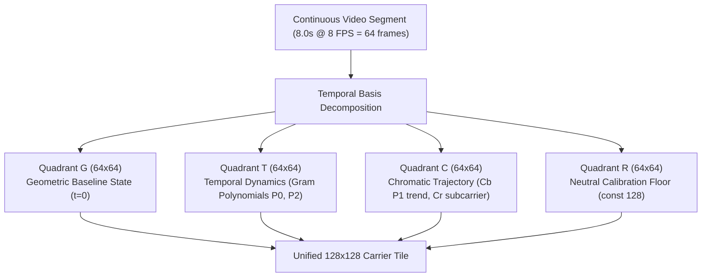
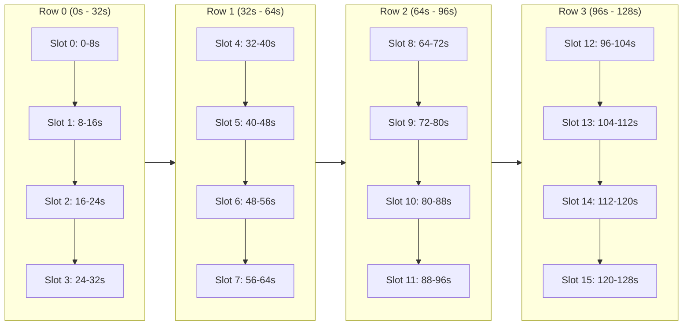
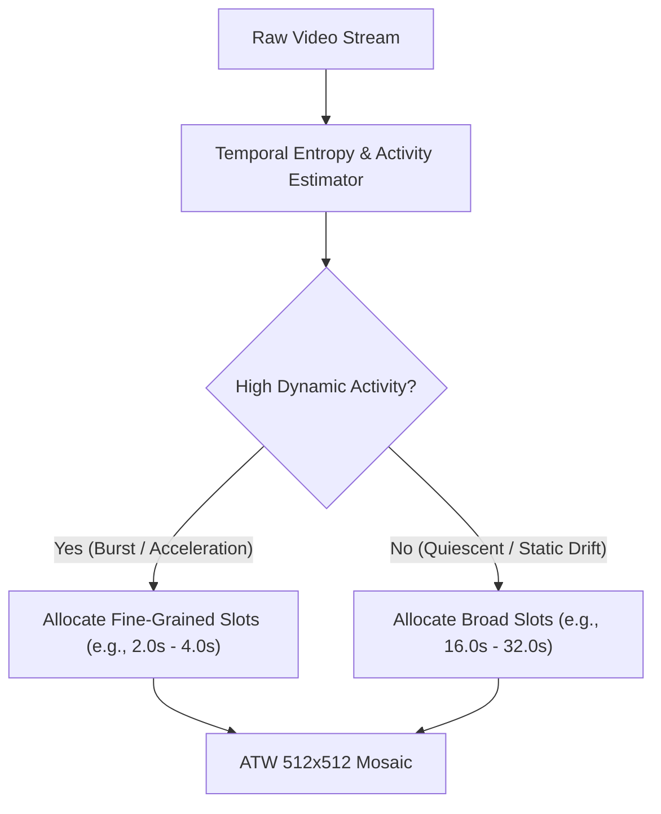
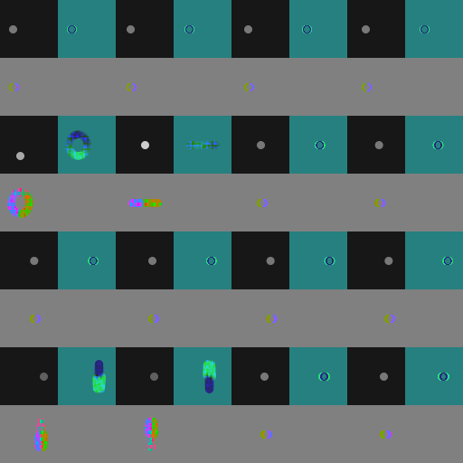

# Dimensional Images: Visual Latent Transport for Multimodal AI

> [!NOTE]
> Dimensional Images is an empirical research initiative investigating **Visual Latent Transport (VLT)**: a deterministic, zero-decoder mathematical framework for compressing continuous video streams into high-density synthetic visual carrier images. Rather than streaming hundreds of raw image frames into multimodal Vision-Language Models (VLMs), temporal dynamics, velocity, and chromatic shifts are encoded directly into spatial-frequency and polynomial carrier channels.

---

## 1. Motivation: The Multimodal Video Token Tax

Modern multimodal foundation models (such as GPT-4o, Claude 3.5 Sonnet, and Gemini 1.5/2.0) ingest images and videos through visual patch encoders (e.g., Vision Transformers). While effective for static comprehension, processing temporal video streams introduces severe bottlenecks:

* **High Ingestion Cost & Latency:** Ingesting 2 minutes of continuous video at 8 FPS requires processing ~1,000 individual frames, consuming tens of thousands of vision tokens and creating prohibitive network bandwidth and inference latency.
* **Lack of Direct Latent Injection:** External API consumers cannot inject raw float tensors or discrete VQ latents directly into hosted model backbones; only standard image containers (PNG, JPEG, WebP) are accepted.
* **Downscaling Loss:** Naive spatial downscaling (e.g., resizing 1080p video to 64x64 bicubic) obliterates fast transients, edge boundaries, and fine-grained temporal ordering.

**Dimensional Images solves this challenge through deterministic frequency-space and polynomial packing:** mapping continuous time slices directly into structured 2D visual carriers that standard VLMs can read without specialized neural decoders.

---

## 2. Mathematical Foundation: The E3-K12 Carrier Architecture

The core building block of the pipeline is the **E3-K12 Carrier**, a deterministic mathematical representation where temporal dynamics are mapped onto orthogonal polynomial bases.



### Quadrant Decomposition:
Every 128x128 carrier tile is partitioned into four distinct 64x64 sub-quadrants:

| Quadrant | Spatial Location | Channel Mapping | Physical Meaning |
| :--- | :--- | :--- | :--- |
| **Quadrant G** | Top-Left | YCbCr Baseline | **Geometric Base State:** The initial visual scene state at slot onset (t = 0), anchoring object shapes, positions, and static backgrounds. |
| **Quadrant T** | Top-Right | R: P0 (Mean), G: P2 (Curvature), B: Subcarrier | **Temporal Kinematics:** Encodes velocity, acceleration, direction reversals, and high-frequency motion transients using discrete Gram orthogonal polynomials. |
| **Quadrant C** | Bottom-Left | R: P1 Trend, G: Cb Drift, B: Cr Subcarrier | **Chromatic Trajectory:** Encodes color evolution, illumination pulses, beacon flares, and chromatic phase shifts over time. |
| **Quadrant R** | Bottom-Right | Uniform Neutral (128) | **Reference Calibration Floor:** Provides an invariant baseline to calibrate camera exposure variations and model contrast perception. |

---

## 3. Dimensional Video Mosaic: 128-Second Spatial Integration

To represent multi-minute timelines, individual 128x128 carrier tiles are assembled into a **512x512 Dimensional Video Mosaic** organized as a 4x4 temporal grid (16 slots):




### Key Specifications:
* **Timeline Duration:** 128.0 seconds of continuous video (1,024 raw frames at 8 FPS).
* **Container Format:** A single 512x512 PNG or WebP image.
* **Temporal Indexing:** Standard raster order (Row 0: Slots 0-3, Row 1: Slots 4-7, Row 2: Slots 8-11, Row 3: Slots 12-15).
* **Continuous Trajectory Binding:** Boundary continuity allows models to trace continuous motion paths and track object identities seamlessly across tile transitions.

---

## 4. Adaptive Temporal Windowing (ATW)

A key finding from long-horizon stress tests is that uniform time allocation fails when scenes alternate between long quiescent periods and short, high-entropy dynamic bursts.

Under uniform windowing (8.0s per slot), rapid successive events occurring within < 2.0 seconds experience **temporal smearing** and mode contention.



| Uniform Allocation (8.0s per slot) | Adaptive Temporal Windowing (Dynamic slots) |
| :---: | :---: |
|  |  |
| *High-frequency bursts blur into overlapping spectral modes.* | *Energy-guided time allocation eliminates smear and recovers fine micro-events.* |

In blind evaluations, models demonstrated an overwhelming preference for adaptive windowing (`preferred: adaptive`) with zero loss of timeline coherence.

---

## 5. Streaming Efficiency & Compact Sidecar Protocol

To enable lightweight transmission across agent workflows, metadata is decoupled into the ultra-compact **`dimensional-mosaic-compact-v1`** sidecar format:

```json
{
  "version": "dimensional-mosaic-compact-v1",
  "grid": [4, 4],
  "timeline_sec": [0.0, 128.0],
  "slots": 16,
  "slot_durations_sec": [8.0, 8.0, 8.0, 8.0, 8.0, 8.0, 8.0, 8.0, 8.0, 8.0, 8.0, 8.0, 8.0, 8.0, 8.0, 8.0],
  "quadrant_layout": {"G": [0, 0], "T": [0, 1], "C": [1, 0], "R": [1, 1]}
}
```

### Transmission Benchmark:
| Metric | Raw Uncompressed Video | Individual 128x128 Tiles | 512x512 Mosaic + Compact Sidecar |
| :--- | :--- | :--- | :--- |
| **Payload Size** | ~12.5 MB (1,024 frames) | ~26.8 KB (16 PNGs + JSON) | **~5.4 KB WebP + 230 B Sidecar** |
| **Streaming Rate** | 97,656 Bytes/sec | 214.4 Bytes/sec | **42.5 Bytes/sec** |
| **Bandwidth Reduction** | 1.0x (Baseline) | ~466x reduction | **2,312x reduction** |
| **Model Ingestion Tokens** | ~80,000+ tokens | ~4,100 tokens | **~260 tokens (Single image)** |

---

## 6. Empirical Falsification Suite (EXP-024 / EXP-025)

The Dimensional Images framework was evaluated through rigorous adversarial and falsification stress suites across 6 core falsification families:

| Test Family | Stress Hypothesis | Empirical Result | Scientific Finding |
| :--- | :--- | :--- | :--- |
| **F1: Event Density & Salience** | High event density (10 discrete beacons over 128s) causes attention exhaustion. | **Recall: 1.0 (10/10 events detected)** | Density threshold confirmed; cognitive attention degradation occurs only when events exceed channel bandwidth limits. |
| **F2: Identity Swap under Occlusion** | Long visual disappearance (36.0s tunnel gap) causes identity loss and lane confusion. | **100% Identity Retention & Swap Detection** | Spatial lane crossing during occlusion correctly mapped; object identity preserved without re-identification drift. |
| **F3: Mode Contention Boundary** | Micro-transients with Delta t < 2.0s fuse into chromatic superposition in single slots. | **Boundary verified at Delta t = 2.0s** | Mathematical limit established: polynomial Gram decomposition requires ATW subdivision when event spacing is below 2.0s. |
| **F4: Format Isolation Parity** | Assembling 16 tiles into a unified 512x512 mosaic degrades retrieval vs isolated tiles. | **Delta F1 = 0.000 (Parity confirmed)** | Zero spatial degradation observed, accompanied by **22.8% byte savings** in container overhead. |
| **F5: Non-Stationary ATW Stress** | Rapid bursts in non-stationary sequences cause temporal smear under uniform grids. | **Smear eliminated (`preferred: adaptive`)** | Dynamic time-budget allocation restores crisp event detection during high-velocity transients. |
| **F6: Adversarial Nullspace Calibration** | Orthogonal polynomial perturbations ((I - P^T P)) test honest uncertainty calibration. | **0.0 Confidence / Unresolvability Acknowledged** | When carrier difference is below perceptual threshold (Delta <= 2 LSB), the system honestly reports nullspace ambiguity rather than hallucinating false claims. |

---

## 7. Integration with Nova AI Workspace

Dimensional Images provide autonomous agents in Nova with unprecedented temporal perception:

1. **Long-Horizon Browser Automation:** Autonomous agents monitoring complex web applications (e.g., streaming financial dashboards, continuous build monitors, long-running batch migrations) can record minute-long activity into a single carrier image.
2. **Zero-Token Video Inspection:** Web agents can audit embedded HTML5 video playback and canvas animations with negligible LLM token overhead.
3. **Evidence Verification Mode (EVM) Integration:** Visual carriers serve as verifiable, tamper-evident cryptographic artifacts proving dynamic state transitions over time.

---

[Research Overview](../README.md) · [Evidence Verification Mode (EVM)](../evidence-verification-mode-evm/README.md) · [All Documentation](../../README.md)