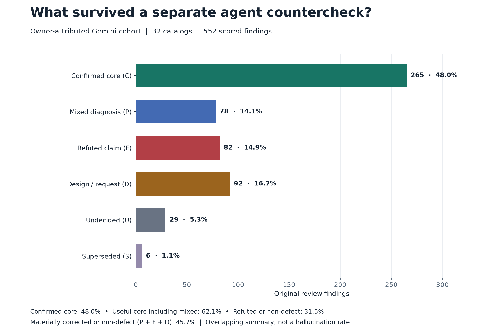
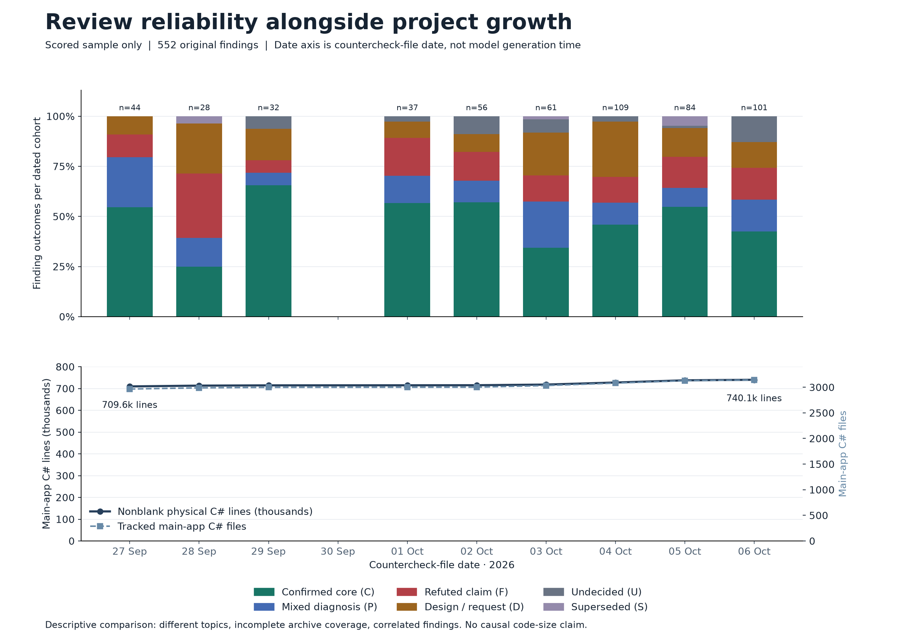
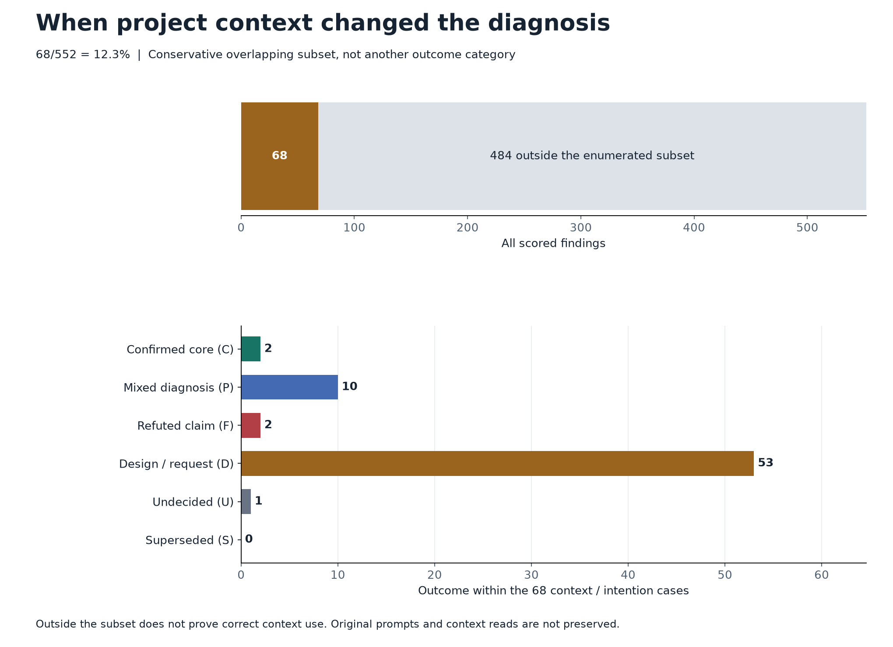
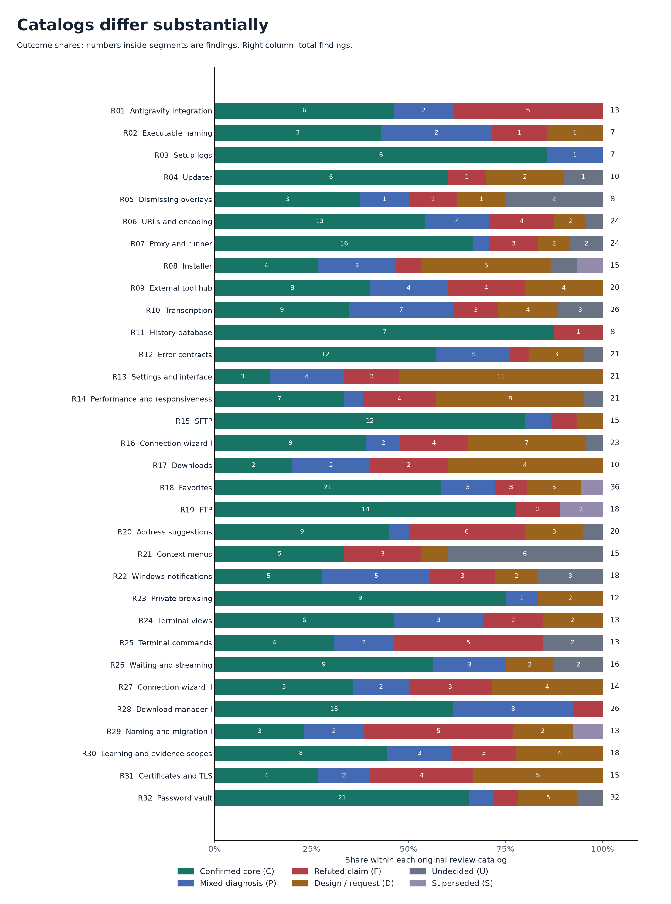

# Reliability of owner-attributed Gemini code reviews in Nova: an empirical case study

Evaluation date: 6 October 2026. Scored countercheck-file dates: 27 September–6 October 2026.

**Coverage: 32 of 53 identified audit/countercheck-pattern catalogs scored (60.4%); 21 September catalogs remain unscored.** This is catalog coverage, not finding coverage: the missing catalogs’ findings have not been enumerated and scored. The sample is not random, and selection bias is a major limitation of the current estimates.

**32 owner-attributed Gemini-pattern review catalogs, separately counterchecked by another agent, contain 552 scored findings.** 265 (48.0%) retained their useful core without a materially corrected diagnosis; another 78 (14.1%) contained a useful issue alongside a material correction. 82 technical claims were refuted and 92 allegations concerned design choices, requested features or known boundaries.

This measures the reliability of reported code-review findings in Nova’s workflow. The denominator is original findings from the recurring Gemini audit pattern, separately counterchecked by another agent. Ordinary bug reports, other-model reviews and new findings discovered by the counterchecker are excluded. It does not measure every Gemini answer or missed defects.

## Attribution and coverage

The project owner identifies this recurring audit/countercheck pattern as Gemini output, including work through AGY/Antigravity. That owner attribution defines the cohort; topic names such as “Antigravity integration” do not establish which model authored a report. The archive does not consistently preserve authenticated model identifiers or supplied prompts/context. Therefore this is an **owner-attributed Gemini-pattern cohort**, not a verified benchmark for a particular Gemini version or a separate measurement of the Antigravity client.

**Coverage is a scored sample, not the entire archive.** A recursive inventory inspected 172 archived Markdown files. The sample includes 27 October catalogs and five September catalogs whose individual counterchecks were adjudicated. Another 21 September files match the audit/countercheck format but remain unscored; they are not assumed correct, incorrect or zero-finding reports. Their omission can change the estimates. The remaining 119 files do not establish comparable original review units for this cohort.

## Gemini 3.7 versus 3.8

Retained AGY history records model identifiers in generation metadata, alongside step timestamps. These are local backend-reported identifiers, not an independently authenticated provider record. We inspected 501 retained conversations across workspaces and used only matching Nova review text for report-level attribution.

| History observation | Europe/Berlin time | Recorded identifier |
|---|---|---|
| Last retained 3.7 generation | 02 September 2026, 22:53:21 +0200 | `gemini-3.7-flash` |
| First retained 3.8 generation | 03 September 2026, 16:17:19 +0200 | `gemini-3.8-flash` |

**3.8 is first recorded on 3 September 2026.** The exact switch lies between these observations; the first surviving entry is not proof of the exact selection time. No later 3.7 generation record appeared in the inspected history. The owner reports using 3.8 consistently after switching. The labels include Flash variants; they are grouped by the recorded 3.7/3.8 family, not treated as identical configurations.

Seven scored catalogs could be linked more directly: a generation-associated payload matched at least two exact original finding headings and most of its finding IDs. Broad numeric-ID matches, quoted/read steps and other-workspace material were excluded. Original generation dates can precede archive/countercheck dates.

| Attribution group | Catalogs | Findings | Confirmed C | Mixed P | Refuted F | Design/request D | Undecided U | Superseded S |
|---|---:|---:|---:|---:|---:|---:|---:|---:|
| 3.7 — metadata-linked scored reports | 0 | 0 | 0 | 0 | 0 | 0 | 0 | 0 |
| 3.8 — metadata-linked scored reports | 7 | 123 | 39 | 20 | 21 | 34 | 8 | 1 |
| Version unlinked — post-switch countercheck dates | 25 | 429 | 226 | 58 | 61 | 58 | 21 | 5 |

The 3.8-linked subset contains catalogs R04, R08, R10, R13, R16, R25, R31. Its confirmed-core share is 39/123 = 31.7%; including mixed diagnoses, useful-core yield is 48.0%. This is a selected attribution subset, not a different matched benchmark.

**There is currently no scored 3.7 comparison group.** Zero scored findings means unavailable comparison data, not zero reliability or zero mistakes. The 25 unlinked catalogs remain in the overall cohort but are not silently assigned to a verified model version. Consequently, the study cannot yet quantify a 3.7-to-3.8 improvement, decline or lack of difference. All dates in the current outcome timeline are after the first retained 3.8 observation.

## Outcomes

Each finding receives one outcome. All percentages below use 552 findings.

| Outcome | Findings | Share | Meaning |
|---|---:|---:|---|
| Useful core confirmed (C) | 265 | 48.0% | Underlying issue supported; does not certify every consequence, severity or proposed fix. |
| Mixed diagnosis (P) | 78 | 14.1% | Useful issue remains, but a material part of the diagnosis was corrected. |
| Technical claim refuted (F) | 82 | 14.9% | Claimed mechanism or behavior did not hold up. |
| Design, request or known boundary (D) | 92 | 16.7% | Intended behavior, a desired extension or a known boundary; no defect against the existing contract established. |
| Undecided (U) | 29 | 5.3% | Measurement/reproduction missing or precautionary hardening without a demonstrated defect. |
| Already fixed or superseded (S) | 6 | 1.1% | No longer applicable at countercheck time; not proof it was originally false. |
| **Total** | **552** | **100%** | Rounded category percentages can differ slightly from 100%. |

The **confirmed-core share** is 265/552 = 48.0%. This is the stricter finding-level reliability indicator; C still does not certify every sentence. The broader **useful-core yield** is 343/552 = 62.1% (C + P). The **refuted or non-defect share** is 174/552 = 31.5% (F + D). Mixed findings should not be described as fully correct, and a true observation about intended behavior should not be described as a technically false statement.

The **materially corrected or non-defect share** is **252/552 = 45.7%** (P + F + D). These findings needed a material diagnosis correction or did not establish a defect against the existing contract. This overlapping summary is not another outcome category and is not a hallucination rate: P may retain a real issue, and D may accurately observe intended behavior.

## Reliability over time and project growth

**Top panel:** finding-weighted outcome shares per countercheck-file date, with the number of original findings shown above each bar. **Bottom panel:** tracked main-application C# nonblank physical lines and file counts from daily Git snapshots, aligned to the same calendar dates. White space between bars means no scored data for that date; it does not mean perfect reliability. Separate panels avoid making two unrelated quantities look proportional.

| Countercheck-file date | Findings | Confirmed C | Useful C + P | Refuted/non-defect F + D | Main-app C# files | Nonblank physical lines |
|---|---:|---:|---:|---:|---:|---:|
| 2026-09-27 | 44 | 54.5% | 79.5% | 20.5% | 2,965 | 709,612 |
| 2026-09-28 | 28 | 25.0% | 39.3% | 57.1% | 2,988 | 713,251 |
| 2026-09-29 | 32 | 65.6% | 71.9% | 21.9% | 2,998 | 714,552 |
| 2026-10-01 | 37 | 56.8% | 70.3% | 27.0% | 3,000 | 714,862 |
| 2026-10-02 | 56 | 57.1% | 67.9% | 23.2% | 3,001 | 715,156 |
| 2026-10-03 | 61 | 34.4% | 57.4% | 34.4% | 3,033 | 718,092 |
| 2026-10-04 | 109 | 45.9% | 56.9% | 40.4% | 3,080 | 727,524 |
| 2026-10-05 | 84 | 54.8% | 64.3% | 29.8% | 3,127 | 737,603 |
| 2026-10-06 | 101 | 42.6% | 58.4% | 28.7% | 3,143 | 740,122 |

Across these snapshot dates, the main application grew from 709,612 to 740,122 nonblank C# lines (**+4.3%**) and from 2,965 to 3,143 tracked C# files. This is a size proxy: it includes comments and excludes tests, helper projects, other languages and uncommitted work. It is not logical SLOC or model context length.

Snapshots use the last first-parent commit in the observed HEAD history at or before the end of each dated file’s day (Europe/Berlin). The current day ends at the observed HEAD. These snapshots are not proven to be the code revisions supplied to Gemini. Dates refer to countercheck files, not authenticated generation timestamps. Some annotations were updated later.

**Interpretation:** differences over time are descriptive, not evidence that Gemini improved or worsened because the project grew. Topics, report sizes, source revisions, context and adjudication strength vary; the unscored September catalogs also leave a coverage gap. This dataset supports neither a causal code-size effect nor a matched model comparison. No significance claim or independent-trial confidence interval is made for correlated findings.

## Context and intentional behavior

A separately enumerated subset of **68/552 findings (12.3%)** encountered an existing intention, documented constraint or known contract that changed the assessment. This conservative subset overlaps the outcome categories and is not added to them. It measures a demonstrated diagnosis/context mismatch, not proof that the model read and ignored an instruction.

Some of these findings still contained a real issue. Others asked to remove behavior that served a documented purpose. Examples below paraphrase the archived counterchecks and omit private implementation details.

| Review topic | Diagnosis or recommendation | What the countercheck established |
|---|---|---|
| Backups | An old backup should be removed as an orphan. | In the failure case, it was the only surviving copy needed for recovery. Deleting it would lose data. |
| Configuration writes | Reverse the write/truncate order to avoid an empty file. | An existing warning documented corruption from that proposed order. The suggested repair would reintroduce it. |
| Navigation | Show a clicked destination in the address bar before navigation commits. | The existing timing protected the distinction between a requested destination and the page actually reached. |
| Search suggestions | Open tabs must not precede ordinary navigation results. | Selecting an existing tab was an intentional alternative to loading the same page again. |
| Transcription | Starting immediately after a file drop is inherently a defect. | Immediate start was the owner's recorded choice. The owner later changed that choice; the later change does not make the original diagnosis correct. |
| Paused downloads | Close retained page resources to eliminate a leak. | Keeping the resources alive was what allowed the download to resume. A timeout would be a new product decision. |

These examples establish a mismatch between the diagnosis and the project's context. They do **not** prove that the model received, read or deliberately ignored the relevant instruction. That requires the original prompts, tool reads and context history.

There were also genuine defects despite reassuring comments or intended architecture. An “intentional” label alone is not a reason to dismiss evidence of broken behavior. The useful-core findings remain credited in the results.

## Counting rules

1. Include original labeled findings in owner-attributed Gemini-pattern audits only when a different agent records an individual countercheck. Use separately adjudicated numbered subfindings where the existing countercheck splits a parent claim. Compound diagnoses otherwise stay one unit.
2. Read the countercheck reason, not only “completed”, “real” or “refuted”. A later repair can be precautionary hardening or a new product decision. A confirmed defect with a materially false mechanism receives P. A severity-only correction does not automatically force P.
3. Exclude positive confirmations and hypotheses already rejected by the original reviewer. Exclude new counterchecker findings from original-review credit, even when found while investigating a false claim.
4. Count each original output once within its report. Repeated findings across reports remain repeated review output; the totals do not represent unique defects. Secondary summaries do not add findings.
5. Leave unmeasured claims U. Keep already-fixed claims S because the generation-time truth may be unknown. Use later documented evidence when it supersedes a stale heading.

This is a retrospective adjudication of counterchecks, not a fresh runtime reproduction of all 552 findings. The counterchecks were performed by other agents in the development workflow; neither blindness to the original reviewer nor independent, blinded adjudication is established. The counterchecker can also make mistakes, and there is no measured inter-rater agreement yet. Evidence ranges from code inspection to targeted tests and live measurements. There is no gold-standard list of all existing defects, so recall and full answer accuracy cannot be calculated.

## Evidence strength and planned validation

The existing ledger records outcome judgments and source references, but **does not yet assign a standardized evidence type to every finding**. Consequently, the study cannot currently report how many refutations rest on direct tests, code-path proof, contracts or reviewer interpretation. A completed fix alone is not evidence that the original diagnosis was correct.

The planned finding-level evidence taxonomy is:

| Evidence type | Basis |
|---|---|
| `static_code_proof` | A concrete code path establishes or excludes the claimed mechanism. |
| `runtime_reproduction` | Recorded runtime observation reproduces or contradicts the claim. |
| `targeted_test` | A relevant test exercises the claimed behavior with an observable result. |
| `documentation_contract` | An existing documented contract or intention establishes what behavior is required. |
| `reasoned_code_review` | Interpretation from code review without a stronger recorded demonstration. |

Each finding should retain its primary `evidence_type`, supporting evidence types, source reference and evidence date. Supporting evidence can overlap; it must not inflate finding counts. These fields describe the countercheck evidence, not a fresh rerun of every historical case.

A future blinded second adjudication should preregister a random 10–20% sample, seed and sampling rule, then provide the original claims and corresponding code/contracts without revealing existing C/P/F/D/U/S classifications or countercheck verdicts. Report initial agreement and a chance-adjusted agreement measure before reconciling disagreements. **No such second-rating result has been measured in this study.**

A proposed **context-sensitive false diagnosis rate** would ask whether a wrong or materially corrected diagnosis was avoidable using context available to the original reviewer. That requires a finding-level causal assessment and a defined context-availability denominator. The current 68 context/intention cases are an overlapping descriptive subset; they do not establish that rate or prove context adherence. Original context reads are not consistently preserved.

## Results by catalog

| ID | File date | Topic | Total | C | P | F | D | U | S |
|---|---|---|---:|---:|---:|---:|---:|---:|---:|
| R01 | 2026-10-01 | Antigravity integration | 13 | 6 | 2 | 5 | 0 | 0 | 0 |
| R02 | 2026-10-01 | Executable naming | 7 | 3 | 2 | 1 | 1 | 0 | 0 |
| R03 | 2026-10-01 | Setup logs | 7 | 6 | 1 | 0 | 0 | 0 | 0 |
| R04 | 2026-10-01 | Updater | 10 | 6 | 0 | 1 | 2 | 1 | 0 |
| R05 | 2026-10-02 | Dismissing overlays | 8 | 3 | 1 | 1 | 1 | 2 | 0 |
| R06 | 2026-10-02 | URLs and encoding | 24 | 13 | 4 | 4 | 2 | 1 | 0 |
| R07 | 2026-10-02 | Proxy and runner | 24 | 16 | 1 | 3 | 2 | 2 | 0 |
| R08 | 2026-10-03 | Installer | 15 | 4 | 3 | 1 | 5 | 1 | 1 |
| R09 | 2026-10-03 | External tool hub | 20 | 8 | 4 | 4 | 4 | 0 | 0 |
| R10 | 2026-10-03 | Transcription | 26 | 9 | 7 | 3 | 4 | 3 | 0 |
| R11 | 2026-10-04 | History database | 8 | 7 | 0 | 1 | 0 | 0 | 0 |
| R12 | 2026-10-04 | Error contracts | 21 | 12 | 4 | 1 | 3 | 1 | 0 |
| R13 | 2026-10-04 | Settings and interface | 21 | 3 | 4 | 3 | 11 | 0 | 0 |
| R14 | 2026-10-04 | Performance and responsiveness | 21 | 7 | 1 | 4 | 8 | 1 | 0 |
| R15 | 2026-10-04 | SFTP | 15 | 12 | 1 | 1 | 1 | 0 | 0 |
| R16 | 2026-10-04 | Connection wizard I | 23 | 9 | 2 | 4 | 7 | 1 | 0 |
| R17 | 2026-10-05 | Downloads | 10 | 2 | 2 | 2 | 4 | 0 | 0 |
| R18 | 2026-10-05 | Favorites | 36 | 21 | 5 | 3 | 5 | 0 | 2 |
| R19 | 2026-10-05 | FTP | 18 | 14 | 0 | 2 | 0 | 0 | 2 |
| R20 | 2026-10-05 | Address suggestions | 20 | 9 | 1 | 6 | 3 | 1 | 0 |
| R21 | 2026-10-06 | Context menus | 15 | 5 | 0 | 3 | 1 | 6 | 0 |
| R22 | 2026-10-06 | Windows notifications | 18 | 5 | 5 | 3 | 2 | 3 | 0 |
| R23 | 2026-10-06 | Private browsing | 12 | 9 | 1 | 0 | 2 | 0 | 0 |
| R24 | 2026-10-06 | Terminal views | 13 | 6 | 3 | 2 | 2 | 0 | 0 |
| R25 | 2026-10-06 | Terminal commands | 13 | 4 | 2 | 5 | 0 | 2 | 0 |
| R26 | 2026-10-06 | Waiting and streaming | 16 | 9 | 3 | 0 | 2 | 2 | 0 |
| R27 | 2026-10-06 | Connection wizard II | 14 | 5 | 2 | 3 | 4 | 0 | 0 |
| R28 | 2026-09-27 | Download manager I | 26 | 16 | 8 | 2 | 0 | 0 | 0 |
| R29 | 2026-09-28 | Naming and migration I | 13 | 3 | 2 | 5 | 2 | 0 | 1 |
| R30 | 2026-09-27 | Learning and evidence scopes | 18 | 8 | 3 | 3 | 4 | 0 | 0 |
| R31 | 2026-09-28 | Certificates and TLS | 15 | 4 | 2 | 4 | 5 | 0 | 0 |
| R32 | 2026-09-29 | Password vault | 32 | 21 | 2 | 2 | 5 | 2 | 0 |
| **Total** | | | **552** | **265** | **78** | **82** | **92** | **29** | **6** |

## Auditability

The [aggregate dataset](data/statistics.json) contains outcome counts per catalog, intent-subset counts and every timeline value; the tables and figures are reproducible from it. Original reports and implementation details remain private. A private ledger preserves finding identifiers, source hashes, classification notes, exclusions, the complete archive inventory and exact Git snapshot revisions. Public readers can recompute counts but cannot independently validate all private adjudications.

The September download catalog illustrates a scoring correction: 24 repaired findings include eight materially corrected diagnoses, not 24 wholly correct reports. In the learning catalog, a new counterchecker finding cannot rescue a refuted original diagnosis. In the notification catalog, updated counterchecks distinguish a real registration retry gap from intentional lifecycle behavior and nonexistent settings.

A future controlled comparison should preserve authenticated model/version, client, generation time, code revision, prompt, supplied context and blinded second adjudication, and use matched tasks across models. Cite the current result as **Nova’s owner-attributed Gemini-pattern review study, scored sample of 32 catalogs, evaluated 6 October 2026**.

[Back to documentation](../../README.md)
