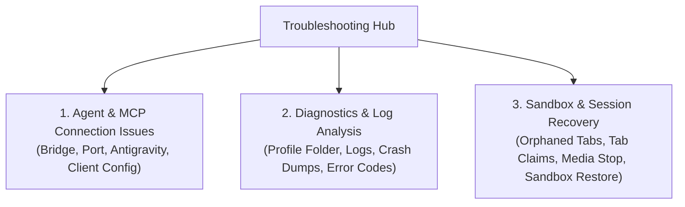

# Troubleshooting & Diagnostics Hub

This section collects log locations, diagnosis steps and recovery procedures for **Nova AI Workspace**: agent connection problems, log analysis, and restoring tabs and sandboxes.

---

## Troubleshooting Navigation

1. **[Agent & MCP Connection Issues (`agent-connection-issues.md`)](agent-connection-issues.md)**
   Step-by-step diagnosis when an agent cannot reach Nova, Claude Desktop shows no Nova tools, Antigravity / Gemini CLI quirks, and client switches like `--mirror-structured-content`.

2. **[Diagnostics & Log Analysis (`diagnostics.md`)](diagnostics.md)**
   Where Nova keeps its logs and crash dumps (`%LOCALAPPDATA%\nova-cognitive\Nova\`, or `%LOCALAPPDATA%\NovaBrowser\` on older installations), how agents read the transport log over MCP, and what the common error codes (`-32602`, `-32040`) mean.

3. **[Sandbox & Session Recovery (`sandbox-and-session-recovery.md`)](sandbox-and-session-recovery.md)**
   Closing abandoned agent tabs, resolving tab claims held by another agent, stopping camera and microphone streams, and how Nova restores sandboxes after a damaged `settings.json`.

---

## Quick Diagnostic Checklist

If your AI agent cannot communicate with Nova:

1. **Does Nova's server answer?** Run `Invoke-RestMethod http://127.0.0.1:27183/health` in PowerShell; `status : ready` means yes. If not, start Nova and check that **Allow agents to control the browser** is ticked in its settings.
2. **Does the bridge work?** Run `& "$env:LOCALAPPDATA\nova-cognitive\Nova\bin\NovaBrowser.McpProxy.exe" --self-test` (older installations: `%LOCALAPPDATA%\NovaBrowser\bin\`).
3. **Is the entry current?** Open the connection wizard in Nova's settings (**Set up**) and connect the program again. Entries with `--pipe` come from outdated instructions and stop the bridge.
4. **Is your AI program restarted?** Clients read their MCP configuration only at startup; restart the program after any change.
