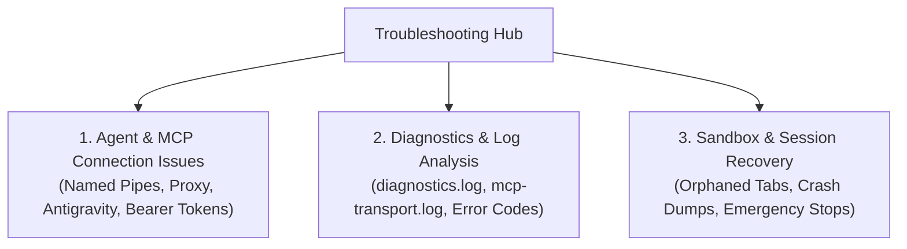

# Troubleshooting & Diagnostics Hub

Welcome to the **Nova AI Workspace Troubleshooting & Diagnostics Hub**. This section provides actionable guidance, log locations, and proven recovery procedures for common runtime issues, agent disconnections, and system diagnostics.

---

## Troubleshooting Navigation

1. **[Agent & MCP Connection Issues (`agent-connection-issues.md`)](agent-connection-issues.md)**
   Solutions for Named Pipe timeouts, missing hammer icons in Claude Desktop, Antigravity / Gemini CLI connection drops, Bearer token rotation, and client-specific flags like `--mirror-structured-content`.

2. **[Diagnostics & Log Analysis (`diagnostics.md`)](diagnostics.md)**
   Where logs and crash dumps are stored on Windows (`%LOCALAPPDATA%\NovaBrowser\`), how to stream real-time logs via MCP, and how to decode standard JSON-RPC error codes (`-32602`, `-32002`).

3. **[Sandbox & Session Recovery (`sandbox-and-session-recovery.md`)](sandbox-and-session-recovery.md)**
   Procedures for clearing orphaned background tabs, recovering closed sandbox contexts, releasing hung leases, and triggering emergency media stops.

---

## Quick Diagnostic Checklist

If your AI agent cannot communicate with Nova:

1. **Is Nova running?** Ensure `NovaAIWorkspace.exe` is open and **MCP Remote Control** is toggled **On** in Settings.
2. **Does the Named Pipe exist?** Run `Get-ChildItem \\.\pipe\ | Where-Object { $_.Name -match "nova" }` in PowerShell.
3. **Did the Bearer Token rotate?** If connecting over HTTP, check your project root `.mcp.json` for the latest token.
4. **Is your CLI restarted?** Terminal clients like Gemini CLI or Claude Code cache server processes; restart the terminal window after editing configuration files.
