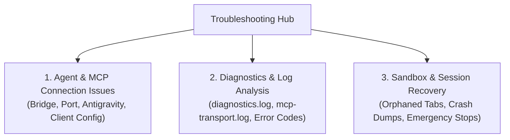

# Troubleshooting & Diagnostics Hub

Welcome to the **Nova AI Workspace Troubleshooting & Diagnostics Hub**. This section provides actionable guidance, log locations, and proven recovery procedures for common runtime issues, agent disconnections, and system diagnostics.

---

## Troubleshooting Navigation

1. **[Agent & MCP Connection Issues (`agent-connection-issues.md`)](agent-connection-issues.md)**
   Step-by-step diagnosis when an agent cannot reach Nova, Claude Desktop shows no Nova tools, Antigravity / Gemini CLI quirks, and client switches like `--mirror-structured-content`.

2. **[Diagnostics & Log Analysis (`diagnostics.md`)](diagnostics.md)**
   Where logs and crash dumps are stored on Windows (`%LOCALAPPDATA%\NovaBrowser\`), how to stream real-time logs via MCP, and how to decode standard JSON-RPC error codes (`-32602`, `-32002`).

3. **[Sandbox & Session Recovery (`sandbox-and-session-recovery.md`)](sandbox-and-session-recovery.md)**
   Procedures for clearing orphaned background tabs, recovering closed sandbox contexts, releasing hung leases, and triggering emergency media stops.

---

## Quick Diagnostic Checklist

If your AI agent cannot communicate with Nova:

1. **Does Nova's server answer?** Run `Invoke-RestMethod http://127.0.0.1:27183/health` in PowerShell; `status : ready` means yes. If not, start Nova and check that **Allow agents to control the browser** is ticked in its settings.
2. **Does the bridge work?** Run `& "$env:LOCALAPPDATA\nova-cognitive\Nova\bin\NovaBrowser.McpProxy.exe" --self-test` (older installations: `%LOCALAPPDATA%\NovaBrowser\bin\`).
3. **Is the entry current?** Open the connection wizard in Nova's settings (**Set up**) and connect the program again. Entries with `--pipe` come from outdated instructions and stop the bridge.
4. **Is your AI program restarted?** Clients read their MCP configuration only at startup; restart the program after any change.
