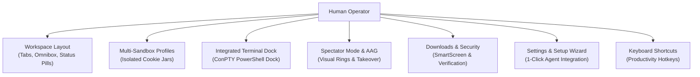

# Nova AI Workspace — User Guide

> [!NOTE]
> Welcome to the Nova AI Workspace User Guide. While Nova is designed for deep programmatic control by AI agents via the Model Context Protocol (MCP), it is equally a high-performance, modern Windows browser for human operators, developers, and power users.

---

## 1. Navigating the User Guide

This user guide walks you through the day-to-day visual workflows, workspace customization, security controls, and hybrid co-pilot capabilities of Nova AI Workspace.

---

## 2. Topic Index

| Guide | Description | Primary Workflows |
| :--- | :--- | :--- |
| **[Workspace Layout](workspace-layout.md)** | Anatomy of the browser window and chrome controls. | Tab strip, omnibox, MCP connection badge, sidebar, status pill. |
| **[Sandboxes & Profiles](sandboxes-and-profiles.md)** | Multi-account isolation without profile switching overhead. | Color-coded tabs, isolated storage jars, ephemeral containers. |
| **[Terminal Dock](terminal-dock.md)** | Built-in Windows ConPTY terminal interface. | PowerShell, Git CLI, dock modes (Hidden, Collapsed, Expanded). |
| **[Live Assist & Spectator Mode](live-assist-and-spectator.md)** | Real-time observation of AI agent interactions. | AAG visual halos, glowing click rings, human-in-the-loop takeover. |
| **[Downloads Manager](downloads-manager.md)** | In-browser file transfer drawer and safety gate. | Windows SmartScreen prompts, hash verification, pause/resume. |
| **[Settings & Setup Wizard](settings-and-connection-wizard.md)** | Configuring Nova and connecting AI tools in 60 seconds. | Claude Code, Codex, Antigravity, local MCP token rotation. |
| **[Native Dialogs & Prompts](native-dialogs-ui.md)** | Operator experience for system-level modals. | File uploaders, basic auth, untrusted certificates, permission gates. |
| **[Keyboard Shortcuts](keyboard-shortcuts.md)** | Comprehensive hotkey cheat sheet for rapid navigation. | Browser shortcuts, terminal toggles, emergency abort keys. |

---

## 3. The Co-Pilot Philosophy

Unlike headless automation tools (Puppeteer, Playwright) that hide the browser in a dark container, Nova AI Workspace operates on the **Dual-Operator Model**:
1. **Full Transparency:** Every action taken by an AI agent (clicks, text input, scrolling, tab switching) is rendered visually with identifiable indicator badges.
2. **Instant Takeover:** At any moment, the human operator can move the mouse, type into an input field, or press `Ctrl+Shift+X` to freeze agent automation and take full manual control.
3. **Shared Context:** You and your AI agent share the exact same DOM, cookies, and authenticated sessions — no re-authenticating with 2FA or passing cookies through insecure scripts.
