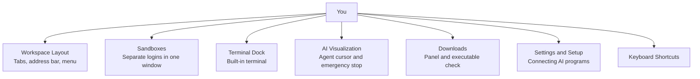

# Nova AI Workspace — User Guide

> [!NOTE]
> Welcome to the Nova AI Workspace User Guide. Nova is built to be controlled by AI agents through the Model Context Protocol (MCP), and it is at the same time a Windows browser that you use yourself, side by side with your agents.

---

## 1. Navigating the User Guide

This guide covers the everyday parts of Nova: the window, sandboxes, the built-in terminal, how agent activity is shown, downloads, dialogs, settings and shortcuts.

---

## 2. Topic Index

| Guide | Description | Primary Workflows |
| :--- | :--- | :--- |
| **[Workspace Layout](workspace-layout.md)** | The parts of the Nova window. | Sandbox pills, tab strip, address bar, status buttons, menu. |
| **[Sandboxes & Profiles](sandboxes-and-profiles.md)** | Several accounts side by side without switching profiles. | Separate browser profiles per sandbox, sandbox tabs, private tabs. |
| **[Terminal Dock](terminal-dock.md)** | The terminal built into Nova. | Workspaces, PowerShell, Claude Code, Codex; dock modes (expanded, collapsed, hidden). |
| **[AI Visualization & Staying in Control](live-assist-and-spectator.md)** | Seeing what an agent does in the browser. | AI cursor and step captions, agent markers, emergency stop. |
| **[Downloads](downloads-manager.md)** | The downloads panel and the check for executable files. | Pause/resume, auto-open, "Keep this file?". |
| **[Settings & Setup Wizard](settings-and-connection-wizard.md)** | Configuring Nova and connecting AI programs. | Claude Code, Claude Desktop, Codex, Antigravity. |
| **[Native Dialogs & Prompts](native-dialogs-ui.md)** | Dialogs outside the web page. | File pickers, HTTP sign-in, certificate warnings, permission requests. |
| **[Keyboard Shortcuts](keyboard-shortcuts.md)** | All shortcuts in one place. | Tabs, navigation, page tools, panels. |

---

## 3. Working Together with Agents

Unlike headless automation tools (Puppeteer, Playwright) that run the browser out of sight, Nova runs agents in the browser you are looking at:
1. **Visible actions:** with the AI visualization switched on (the default), agent clicks, typing and scrolling are shown with an on-screen cursor and a short caption, and tabs an agent works in are marked.
2. **Stopping at any time:** **Menu → Emergency stop** interrupts agent work immediately and stays active until you release it.
3. **Shared context:** you and your agent use the same pages, cookies and logged-in sessions — no logging in again, no copying cookies into scripts.
