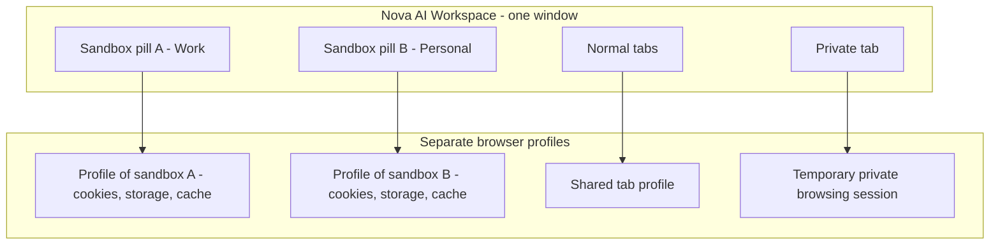

# Sandboxes & Profile Isolation

> [!NOTE]
> In Nova AI Workspace you do not need separate browser windows or profile switching to use several accounts. **Sandboxes** keep separate logins side by side in one window.

---

## 1. What Are Sandboxes?

For example, keep a work account in sandbox A and a personal account in sandbox B. Both remain available in the same window without repeatedly signing out.

In Nova:
* **One window, several identities:** sandbox A can be logged into one account of a service while sandbox B is logged into a second account of the same service, and your normal tabs use a third session.
* **Separate browser profiles:** each sandbox has its own browser profile with its own cookies, sessions, site storage and cache. Proxy, fingerprint protection and vault autofill can be set per sandbox.
* **Normal tabs and private tabs** are separate from all sandboxes. Normal tabs share one common profile; private tabs (`Ctrl+Shift+N`) use a temporary session separate from your normal tabs. Private tabs in the same session can share a login; the session ends when its last tab closes and is not restored after a restart. Downloaded files remain on disk. Private browsing does not hide your activity from websites or your network.

---

## 2. Working with Sandboxes in the UI

### 2.1 Opening a Sandbox
* Each visible sandbox appears as a **pill** in the title bar next to the tabs. Click it to switch to that sandbox.
* With many sandboxes, **Find a sandbox** opens a searchable list (**Search sandboxes**, **Manage sandboxes...**).
* A sandbox without a remembered page shows **Sandbox needs a start page**, where you set its **Start URL**.

### 2.2 Creating and Managing Sandboxes
* Under **Settings → Sandboxes**, **+ Add sandbox** creates a new one (up to 100). Each sandbox has a **Name**, a colour and a **Start URL**, and can use its own **Proxy**, fingerprint protection and vault autofill setting.
* **Hide** removes a sandbox from the title bar without deleting its data; hidden sandboxes are listed under **Hidden sandboxes** and can be shown again.
* **Clear data...** clears the **Cache**, **Cookies and site data** or **History and last URL** of one sandbox, or **Reset entire sandbox**. **Delete...** removes the sandbox and all its data permanently.

### 2.3 The Pill Menu
Right-click a sandbox pill for:
* **Mark** — show nothing, a **Colour** or the **Site icon** in front of the name.
* **Proxy** — disconnect or reconnect the sandbox's proxy, or open **Proxy settings...**.
* **Allow tabs in this sandbox** — see below.
* **Hide from toolbar** and **Clear sandbox data...**.
* **Release agent** — releases an agent's claim on this sandbox (shown while an agent holds one).

### 2.4 Tabs Inside a Sandbox
A sandbox shows one page. When a page in it opens a link in a new tab or a popup, Nova opens a **sandbox tab** that keeps the sandbox's session, so a sign-in or payment flow does not lose its login. The tab carries a badge: *Tab of sandbox {name} — shares its session*. This is on by default and can be switched off per sandbox with **Allow tabs in this sandbox**.

### 2.5 Leaving the Sandbox
If a page in a sandbox tries to continue on a host that does not belong to the sandbox — often an age check, sign-in or payment step — Nova asks **This page wants to leave the sandbox** with **Allow for this step** or **Always in this sandbox**.

> [!NOTE]
> Browser-profile isolation and website permission policy are separate. Do not assume a saved permission is restricted to the sandbox where you granted it. See [Website and agent permissions](permissions.md).

---

## 3. Working beside an agent

Agents can work in normal tabs, sandbox pages, sandbox tabs and private sessions. The agent marker shows where a claim is active; it does not merge the profiles. Check the sandbox name before signing in or asking an agent to use a particular account.

For the underlying design, see [Sandbox isolation](../../core-features/sandbox-isolation/README.md). Agent interfaces are documented in the [MCP reference](../../mcp-reference/README.md).

[Back to this section](README.md) · [All user guides](../README.md)
