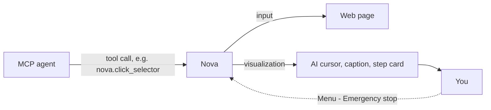

# AI Visualization & Staying in Control

> [!NOTE]
> Nova AI Workspace shows you what an agent does in the browser while it does it, marks the tabs and sandboxes an agent is working in, and gives you an emergency stop. In the product this view is called **AI visualization**; it was described as "Live Assist" or "Spectator Mode" in earlier versions of this guide.

---

## 1. What Is the AI Visualization?

Keep this view enabled when you want to follow an agent's browser work without reading its tool calls. It shows supported actions as they happen; it is not a transcript of the agent's private reasoning.

The **AI visualization** (also called the assist cursor) mirrors agent actions on screen:
* An on-screen cursor labelled **AI** moves to the element the agent is about to use and pulses when it acts.
* A short caption says what is happening — for example *Searching target...*, *Target locked*, *Performing action...*, *Verified* or *Verification failed*.
* An optional step card shows the current and the next step (*Step 2/5: Click*, *Next step: Verify result*).

It covers clicks, typing, option selection, scrolling, waiting for elements, navigation and the guarded actions.

---

## 2. Settings & Indicators

### 2.1 Turning It On or Off
* The visualization is on by default. Toggle it quickly with **Menu → View → AI visualization**.
* Under **Settings → Appearance & performance → AI visualization** you find **Show assist cursor (AI)**, **Assist cursor: reduced motion** and **Show optional step card (current and next step)**. Less certain steps move slower and stay visible longer.

### 2.2 Agent Markers on Tabs and Sandboxes
* Tabs and sandbox pills that an agent works in carry a marker. Its tooltip tells you the state: *Agent active*, *Agent recently active* or *Agent reserved* (the agent has claimed the tab but is not acting right now).
* While agents are active, an activity indicator lists active and reserved targets; from its details you can switch to a claimed tab or release the claim. On a sandbox pill, **Release agent** does the same.
* Outside the window, the Nova button in the taskbar shows agent activity; when Nova keeps running in the background, its icon in the notification area says *an agent is working*.

---

## 3. Staying in Control

1. **Emergency stop:** **Menu → Emergency stop** interrupts agent work at once — pending MCP requests, running crawls, scheduled task runs, all sessions of Nova's terminal service (including your own terminals in the dock) and connections to external MCP servers. Nova confirms with *Emergency stop active. Agents, the agent interface (MCP), and running scripts were interrupted.*
2. **Releasing the stop:** the stop stays active until you choose **Menu → Release emergency stop**. After that, agents and the agent interface can run again.
3. **Your own input:** you can keep using the browser while an agent works — it is the same browser with the same sessions. When you type or use browser shortcuts, the visualization steps aside. This does not pause the agent; to interrupt all agent work, use the emergency stop. To take over one claimed tab, release its claim from the activity details or choose **Release agent** on the sandbox pill; confirm **Take over control** if prompted. Releasing a claim is distinct from the global emergency stop.

There is no keyboard shortcut for the emergency stop.

For a step-by-step guide to stopping and continuing, including the effect on your own terminals and completed actions, see [Emergency Stop](../getting-started/emergency-stop.md).
