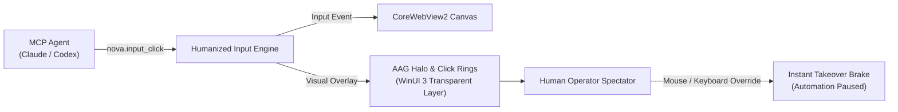

# Live Assist & Spectator Mode

> [!NOTE]
> Watch your AI agents browse, fill forms, and solve complex multi-step tasks in real time. Nova AI Workspace features visual indicators, action overlays, and an instantaneous manual takeover mechanism.

---

## 1. What Is Spectator Mode?

Automating browsers with traditional tools often feels like handing your computer keys to an invisible ghost. You don't know where the agent is clicking, what fields it is typing into, or when it gets stuck on a captcha or modal.

**Spectator Mode** bridges the human-agent gap:
* Every click generates an animated visual ring on the exact coordinates.
* Form filling displays a subtle indicator box around active input fields.
* Scrolling motions use humanized bezier velocity curves that your eyes can track smoothly.

---

## 2. Visual Interaction Cues

### 2.1 The Glowing Click Ring
When an agent invokes `nova.input_click` or `nova.click_selector`:
* A pulsating colored ring expands and fades out at the target coordinates.
* **Green Ring:** Successful click on an interactive element (button, link, input).
* **Amber Ring:** Click dispatched near an element edge or guarded surface.
* **Red Flash:** Click intercepted or blocked by an active AAG policy (e.g. payment submission without human confirmation).

### 2.2 The AAG Status Halo
A thin, unobtrusive glowing perimeter lines the active browser tab:
* **Purple Glow:** AI agent currently executing automated steps.
* **Yellow Pulse:** Agent waiting for page settlement, network idle, or modal appearance.
* **Red Glow:** Safety stop triggered; agent awaiting operator guidance or approval.

---

## 3. Instant Human Takeover (Co-Pilot Mode)

You never lose control of your browser:

1. **Physical Takeover:** The moment you move your physical mouse or hit a key on your keyboard inside the active tab, Nova's **Physical Takeover Brake** activates:
   * Ongoing synthetic agent inputs are immediately paused.
   * The agent receives an execution response indicating that the operator has taken manual focus.
2. **Emergency Abort Hotkey (`Ctrl+Shift+X`):**
   * Instantly terminates all active MCP tool executions across all tabs.
   * Drops all tab ownership leases.
   * Revokes any pending native dialog submissions.
3. **Resuming Agent Control:**
   * Once you have solved the captcha, selected a two-factor code, or completed manual review, click the **Resume Agent** pill in the top toolbar.
