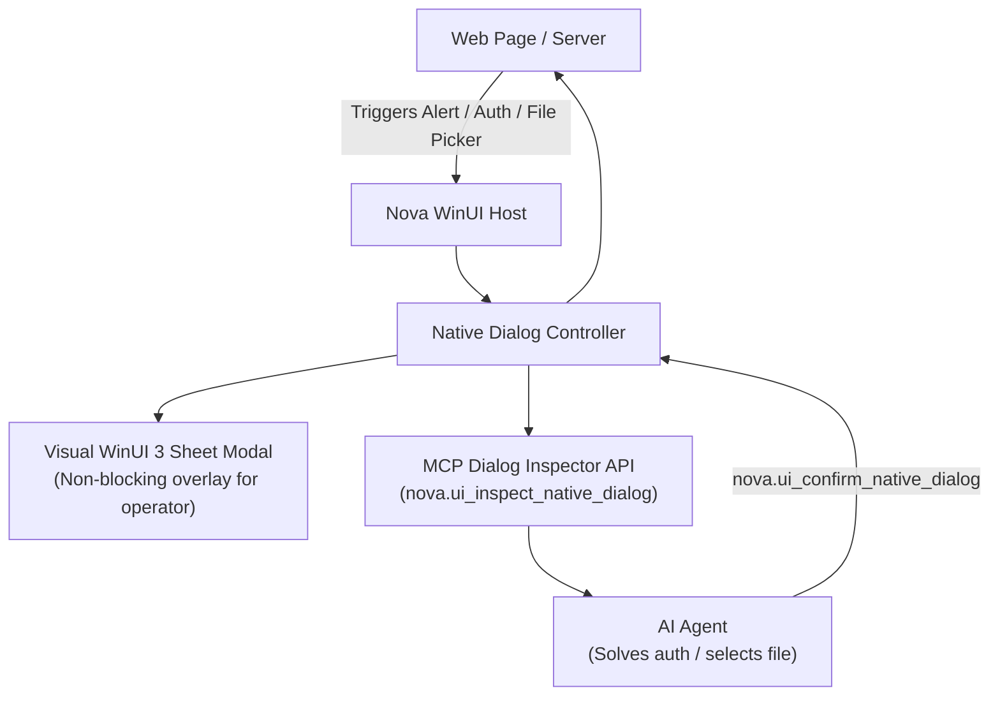

# Native Dialogs & System Prompts

> [!NOTE]
> How Nova AI Workspace presents native operating system file pickers, basic HTTP authentication, and SSL security prompts to operators — and how AI agents handle them without freezing.

---

## 1. The Native Dialog Problem

Traditional automated browsers struggle with native Windows dialogs:
* Standard JavaScript in the page cannot interact with OS file dialogs (`OpenFileDialog`, `SaveFileDialog`).
* HTTP 401 Basic Auth triggers a native modal that blocks the browser UI thread completely.
* Untrusted SSL certificates or self-signed intranet certs display security walls that halt automation runs.

Nova solves this with an **In-Chrome Virtualized Dialog Engine** and automated OS hook bridges.

---

## 2. Handled Dialog Categories

### 2.1 File Pickers (Upload & Download)
* When a website triggers a file upload, Nova can either display the native Windows Explorer picker for the operator, or allow an agent to supply the target path programmatically via `nova.ui_set_native_dialog_file_name` and `nova.ui_confirm_native_dialog`.
* Prevents the browser from freezing waiting for an unseen file picker on headless or dual-monitor setups.

### 2.2 HTTP 401 Basic & Digest Authentication
* Instead of a blocking Windows credential prompt, Nova renders a non-blocking floating card.
* Credentials can be entered manually by the user or filled securely by the agent from the encrypted Nova Vault.

### 2.3 SSL Certificate Overrides
* For local development environments (`https://localhost:5001`, internal self-signed corporate origins), Nova provides clear visual warnings with options to permanently trust or temporarily bypass for the session.

---

## 3. Operator Controls & Safety Override

Whenever a native dialog or security prompt appears:
* The operator can dismiss the prompt manually at any time by pressing **`Escape`**.
* A clear banner indicates whether the dialog was triggered by human browsing or background agent automation.
