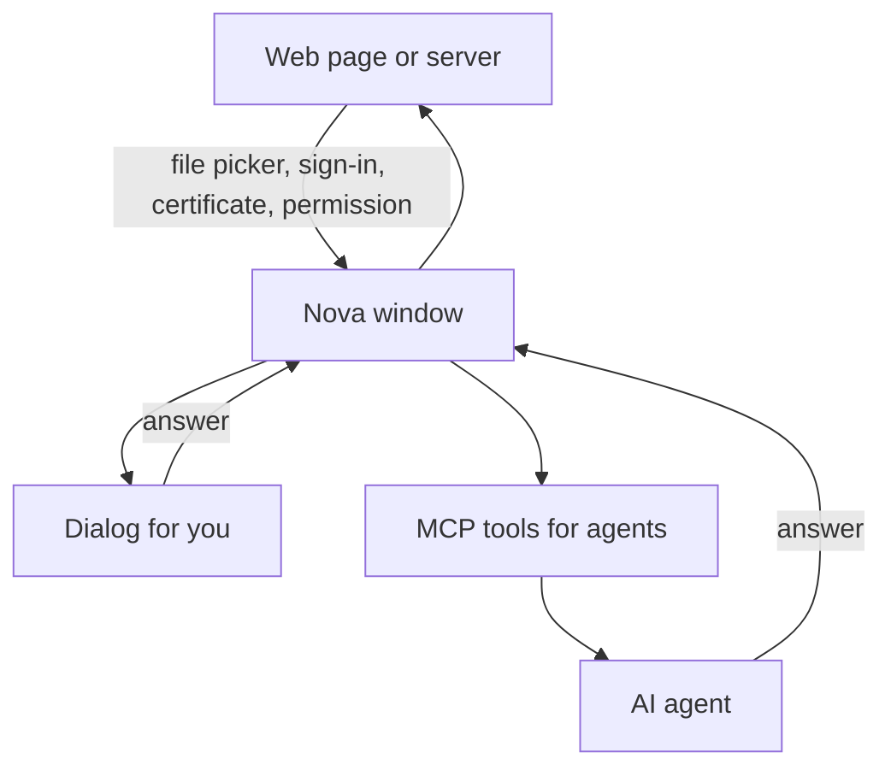

# Native Dialogs & System Prompts

> [!NOTE]
> How Nova AI Workspace presents file pickers, HTTP sign-ins, certificate warnings and permission requests to you — and how AI agents can answer them without getting stuck.

---

## 1. The Native Dialog Problem

Dialogs outside the web page are a classic dead end for browser automation:
* JavaScript in the page cannot operate the Windows file dialogs (Open / Save As).
* An HTTP sign-in request (a server asking for user name and password) appears outside the page.
* An invalid or self-signed certificate stops the page before it loads.

While such a dialog is open, the agent's next action cannot proceed. Nova therefore shows these questions in its own dialogs and gives agents tools to inspect and answer them.

---

## 2. Handled Dialog Categories

### 2.1 File Pickers (Upload & Download)
* When a page opens a file chooser, Windows' standard Open or Save dialog appears and you can use it as usual.
* An agent can inspect an open dialog with `nova.ui_inspect_native_dialog`, type a path into its file-name field with `nova.ui_set_native_dialog_file_name`, and press the main button with `nova.ui_confirm_native_dialog`. `nova.ui_dismiss_native_dialog` cancels it.
* For uploads an agent usually skips the dialog entirely: `nova.file_upload` attaches files directly to the page's file field.

### 2.2 HTTP Sign-in
* Nova shows a **Sign in** dialog that names the site, the area the server asks for, and warns when the connection is not encrypted.
* You can pick a **Saved login** from the password vault, or enter **User name** and **Password** and tick **Save in password vault**.
* An agent answers with `nova.ui_auth_prompt_resolve`: `use_vault` signs in with a stored vault entry for that site; `cancel` declines. The agent never handles the password itself.

### 2.3 Certificate Problems
* For an invalid certificate (expired, wrong address, revoked, not trusted — for example a self-signed certificate on `https://localhost`), Nova shows **Connection is not secure** with **Go back** and **Continue anyway**. **Show details** lists issuer, validity and fingerprint.
* **Continue anyway** applies only to this certificate, in this profile, until Nova closes. Nova never trusts a certificate permanently.
* An agent answers with `nova.ui_certificate_prompt_resolve` (`proceed` or `refuse`).
* When a server asks *you* to identify yourself with a certificate, Nova asks **Identify yourself?** with **Send selected** and **Send none**.

### 2.4 Permission Requests
* Camera, microphone and similar requests appear as **Allow access?** with **Allow once**, **Always allow** and **Block**.
* An agent can answer or postpone such a request with `nova.ui_permission_prompt_resolve` (`allow`, `deny` or `defer`).

### 2.5 Executable Downloads
* See [Downloads](downloads-manager.md#3-executable-files-keep-this-file).

---

## 3. Operator Controls & Safety

* In the security questions (**Connection is not secure**, **Keep this file?**), the safe answer is the default button, and `Escape` also gives the safe answer. Only an explicit click on **Continue anyway** or **Keep** takes the risky path.
* Agents can see which tab or sandbox raised an open dialog, so in a shared Nova an agent can tell whether a dialog is its own to answer.

More background: [Native Dialogs & Prompts](../core-features/native-dialogs-and-prompts.md).
