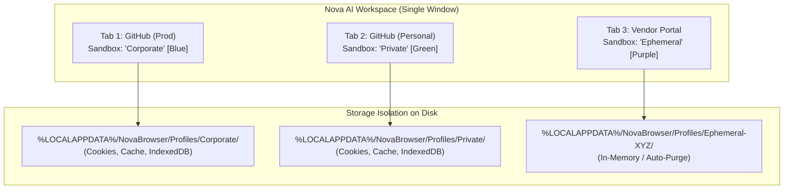

# Sandboxes & Profile Isolation

> [!NOTE]
> In Nova AI Workspace, you never need to launch separate browser instances or manage cumbersome profile windows. Nova introduces **In-Window Sandboxes** — multi-account session isolation within a single unified tab strip.

---

## 1. What Are Sandboxes?

Traditional browsers isolate user profiles into completely separate OS windows, making side-by-side comparison, tab management, and automated switching clumsy and slow.

In Nova:
* **One Window, Multiple Identities:** Tab A can be logged into AWS Account #1, while Tab B is logged into AWS Account #2, and Tab C is an ephemeral guest session.
* **Zero Cookie Bleed:** Each Sandbox maintains a completely isolated WebView2 User Data Folder (UDF), separate cookie jars, independent local storage, IndexedDB, and cache partitions.

---

## 2. Working with Sandboxes in the UI

### 2.1 Opening a New Tab in a Specific Sandbox
1. Right-click the **New Tab (+)** button in the tab bar.
2. Select your desired Sandbox from the context menu (e.g., *Default*, *Work*, *Research*, *Disposable*).
3. The newly opened tab immediately adopts the color theme and isolated storage of that sandbox.

### 2.2 Moving Tabs Between Sandboxes
* Right-click any active tab $
ightarrow$ select **Move to Sandbox** $
ightarrow$ choose destination.
* Nova will preserve the URL and reload the page under the destination sandbox's cookie jar.

### 2.3 Ephemeral / Disposable Sandboxes
* Need to test a payment gateway, sign up for a newsletter, or visit an untrusted link?
* Select **New Ephemeral Tab**.
* All cookies, storage, and downloaded temporary cache are wiped automatically from disk the moment the tab is closed.

---

## 3. Agent & MCP Interaction

AI agents can programmatically target sandboxes using MCP tools:
* `nova.sandbox_create` / `sandbox_list`: Create and inspect isolated environments.
* `nova.tab_new` with parameter `sandboxId`: Launches targeted automation inside specific enterprise identities without risking operator sessions.
