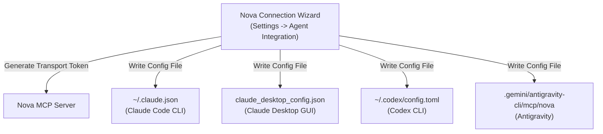

# Settings & Agent Connection Wizard

> [!NOTE]
> Setting up AI agents to control Nova takes less than 60 seconds. Use the built-in Connection Wizard to integrate Anthropic Claude Code, OpenAI Codex, or Google Antigravity with a single click.

---

## 1. Accessing Settings

Press **`Ctrl+,`** or click the gear icon in the top-right corner to open the Settings panel.

The Settings interface is organized into clean categories:
* **General:** Default search engine, home page, startup behavior, hardware acceleration.
* **Appearance:** Windows Mica backdrop, dark/light themes, accent color, UI scaling.
* **MCP Remote Control:** Port configuration, bearer token rotation, connection security.
* **Agent Integration:** One-click registration wizards for all supported AI development tools.
* **Privacy & Sandboxes:** Default sandbox identities, cookie retention rules, ephemeral defaults.
* **Terminal Dock:** Default shell executable, font family, font size, buffer scrollback depth.

---

## 2. The 1-Click Connection Wizard

To connect an AI coding assistant to Nova AI Workspace:

1. Open **Settings** $
ightarrow$ navigate to **Agent Integration**.
2. Select your AI assistant:
   * **Anthropic Claude Code (CLI)**
   * **Anthropic Claude Desktop**
   * **OpenAI Codex**
   * **Google Antigravity**
3. Click **Configure Automatically**.

---

## 3. Manual Connection & Token Configuration

If you are using a custom agent or running on a separate machine across the local network:

1. In **Settings** $
ightarrow$ **MCP Remote Control**:
   * **Server Mode:** Named Pipe (fastest, local only) or HTTP/SSE (accessible over localhost or intranet).
   * **Named Pipe Name:** `\\.\pipe\nova-mcp-workspace`
   * **HTTP Port:** Default `63721`
2. **Rotating Bearer Token:**
   * Nova automatically generates a cryptographically secure 256-bit token on every launch.
   * Click **Copy Bearer Token** or **Regenerate Token** to update external clients.
3. **Emergency Disconnect:**
   * Toggle **Enable Remote Control** to `OFF` to immediately sever all agent connections and close all external communication sockets.
