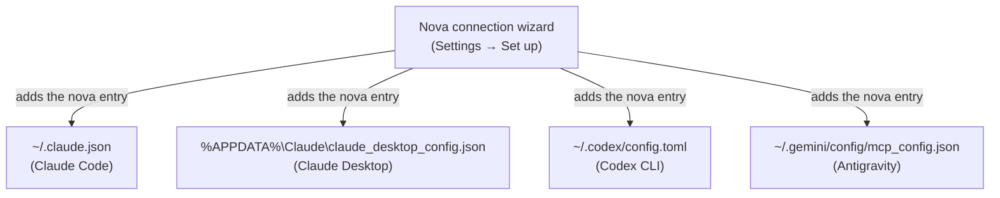

# Settings & Agent Connection Wizard

> [!NOTE]
> Most people never need to configure anything: Nova registers itself with the AI programs it finds on your computer. The connection wizard is there when you want to check that, connect a program later, or connect one Nova cannot set up by itself.

---

## 1. Opening the Wizard

Nova shows the wizard on first start (**Welcome to Nova**). Later, open Nova's settings and click **Set up** in the navigation (*Set up the connection to your AI programs*).

---

## 2. What the Wizard Does

1. **Let your AI use Nova** — switches on agent access if it is off (**Enable AI access**).
2. **How would you like to connect Nova?**
   * **Easy setup (recommended):** Nova lists the AI programs it found — Claude Code, Claude Desktop, OpenAI Codex, Google Antigravity. Click **Connect** next to the one you want. Nova adds its entry to that program's settings and keeps it up to date. Restart the program afterwards so it picks Nova up.
   * **Set up manually:** for experienced users who want to copy the connection details themselves.
3. **Connect another program** — for a program Nova cannot set up by itself, **Copy setup text** gives you ready-made instructions to paste into that program.
4. **How the connection is saved** — lists the exact files Nova writes to.

Nova only adds or updates its own entry in these files; other entries stay untouched. The entry starts Nova's stdio bridge (`NovaBrowser.McpProxy.exe` in Nova's profile folder), which finds Nova and its access key by itself — so no password or access key is written into your AI program's settings.

---

## 3. Manual Connection

For your own scripts or a program the wizard does not know:

* **Easiest:** start Nova's stdio bridge from your program, exactly as the entries above do. See [Custom agents](../integration/custom-agents.md).
* **Direct HTTP:** Nova's MCP server listens on `http://127.0.0.1:27183/mcp` by default. The port can be changed in the settings (**Local port**). Every request needs the access key as `Authorization: Bearer <key>`; the wizard step **Connect another program** shows the address and lets you copy the key (**Copy key**). Details: [Protocol and transport](../mcp-reference/protocol-and-transport.md).
* **From another computer:** off by default. It needs **Allow access from other devices on the network** in the settings; only switch this on in a network you trust, because anyone with the key can then control your browser.

To stop all agent access at once, untick **Allow agents to control the browser** in the settings.
